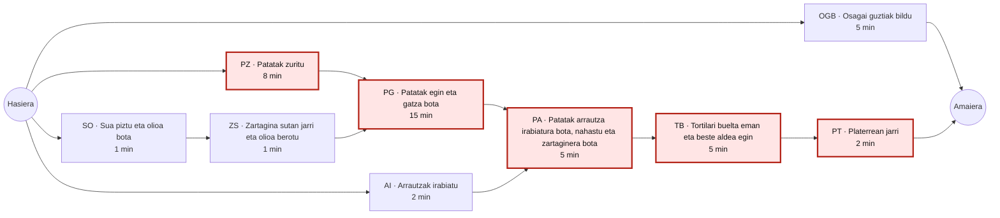
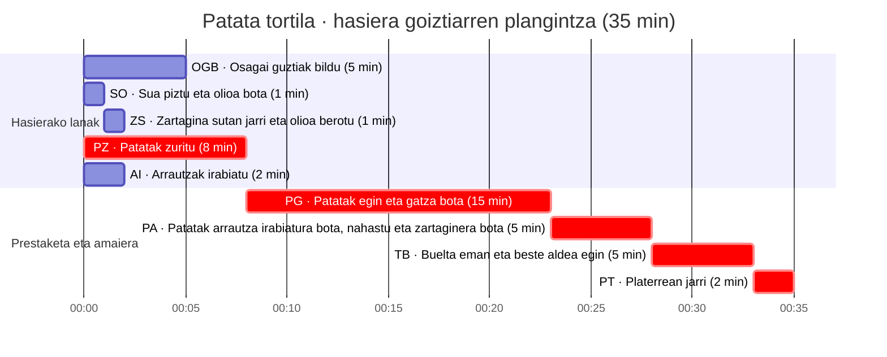

# Patata tortilaren plangintza: PERT eta Gantt ebazpena

**Iturria:** [Patata tortila: planifikazioa eta kostuak lantzeko ariketa](<../materialak/patata tortila - planifikazioa eta kostuak lantzekoAA 2026-2027.md>). Iraupenak eta hiru galderak bertatik hartu dira. Beheko mendekotasunak **ebazpen honen suposizioak** dira, enuntziatuak ez baititu zehazten.

## Suposizioak eta mendekotasunak

- OGB (osagai guztiak bildu) gainerako lanekiko independentea da; lana amaitutzat jotzeko OGB ere bukatuta egon behar da.
- SO (sua piztu eta olioa bota) amaitzean hasi daiteke ZS (zartagina sutan jarri eta olioa berotu).
- PG (patatak egin eta gatza bota) hasteko PZ (patatak zuritu) eta ZS amaitu behar dira.
- PA (patatak arrautza irabiatura bota, nahastu eta zartaginera bota) hasteko PG eta AI (arrautzak irabiatu) amaitu behar dira.
- TB (tortilari buelta eman eta beste aldea egin) PAren ondoren doa.
- Iturriak «platerrean jarri» (PT) frijitzeko lanen artean zerrendatzen du. **Hemen azken platereratzea dela suposatzen da: TBren ondoren egiten da**, 2 minututan.
- Iraupenak deterministak dira. Lan paraleloaren kalkuluan behar adina sukaldari, tresna eta tokia daudela suposatzen da; pertsona bakarraren kalkuluan lan guztiak bata bestearen ondoren egiten dira.

## PERT mendekotasun grafikoa

Lodiz eta kolorez nabarmendutako nodoek **bide kritikoa** osatzen dute. OGB amaierara doan adar independentea da.

## Denboren kalkulua

Denbora 0 hasierako unea da. **Hasiera goiztiarra** aurreko zeregin guztien amaiera goiztiarren maximoa da; **amaiera goiztiarra** hasiera gehi iraupena. Amaieratik atzera kalkulatuta, **lasaiera** hasiera berantiarraren eta goiztiarraren arteko aldea da. Amaierako muga 35 minutuan finkatu da, OGB eta PT biak bukatuta izateko.

| Zeregina | Iraupena (min) | Aurrekoak | Hasiera goiztiarra | Amaiera goiztiarra | Hasiera berantiarra | Amaiera berantiarra | Lasaiera (min) |
|---|---:|---|---:|---:|---:|---:|---:|
| OGB | 5 | — | 0 | 5 | 30 | 35 | 30 |
| SO | 1 | — | 0 | 1 | 6 | 7 | 6 |
| ZS | 1 | SO | 1 | 2 | 7 | 8 | 6 |
| PZ | 8 | — | 0 | 8 | 0 | 8 | **0** |
| PG | 15 | PZ, ZS | 8 | 23 | 8 | 23 | **0** |
| AI | 2 | — | 0 | 2 | 21 | 23 | 21 |
| PA | 5 | PG, AI | 23 | 28 | 23 | 28 | **0** |
| TB | 5 | PA | 28 | 33 | 28 | 33 | **0** |
| PT | 2 | TB | 33 | 35 | 33 | 35 | **0** |

PGren hasiera `max(8, 2) = 8` da; PArena `max(23, 2) = 23`. Beraz, PT 35. minutuan amaitzen da, eta OGB lehenago amaituta dago.

## Gantt diagrama: lan paraleloa

GitHubek errendatzen duen Mermaid Gantt honetan **2026-09-24 00:00 ereduaren 0. minutua** da; data marrazkia egiteko erreferentzia hutsa da, ez benetako ekoizpen data. Barrak goiko hasiera goiztiar eta iraupenen arabera kokatu dira. `crit` markak bide kritikoko lanak bereizten ditu.

Gantt barrak PERTeko aurreko zeregin guztiak bukatu ondoren hasten dira.

## Hiru galderen erantzunak

1. **Zein da atzeratu ezin daitekeen lerro kritikoa?** `PZ → PG → PA → TB → PT`. Iraupena `8 + 15 + 5 + 5 + 2 = 35 min` da. Bide horretako zeregin bakoitzaren lasaiera zero da; haietako bat atzeratzeak amaiera atzeratzen du.
2. **Zenbat denbora behar du plangintzak tortila bat egiteko?** Behar adina sukaldarirekin eta goiko lan paraleloarekin, **35 minutu**. Sukaldari **bakar batek** bederatzi lanak egin behar baditu, ezin ditu gainjarri: `5 + 1 + 1 + 8 + 15 + 2 + 5 + 5 + 2 = 44 minutu`. Adibidez, `OGB → SO → ZS → PZ → PG → AI → PA → TB → PT` ordena baliozkoa da eta 44 minututan amaitzen da.
3. **Sukaldari bat baino gehiagorekin denbora aurreratu daiteke?** Bai: lan independenteak aldi berean eginda, 44 minututik **35 minutura** jaits daiteke, hau da, 9 minutu aurreztu. 35 minutu da suposizio hauen araberako beheko muga, bide kritikoko lanak ezin direlako elkarren gainean jarri. Gantt-eko hasiera goiztiarreko adibidean OGB, SO, PZ eta AI aldi berean hasten dira; horretarako behar adina langile eta baliabide behar dira.
