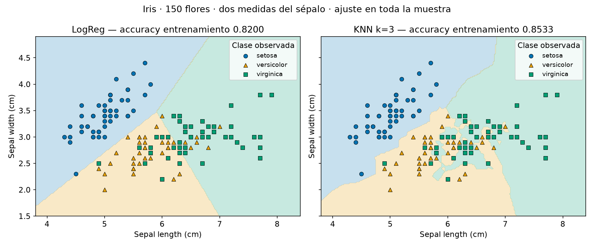

# Sailkapen Txostena: Regresión Logística frente a KNN

**Alumno:** Unai Urzainqui Perez. **Asignatura:** 5072. **Tarea:** 63325.

## 1. Helburua / Objetivo

Comparar visualmente un clasificador lineal, Regresión Logística, y uno basado en vecinos, KNN. Se utiliza Iris: 150 flores, 50 setosa, 50 versicolor y 50 virginica. Para dibujar las fronteras en dos dimensiones se seleccionan longitud y anchura del sépalo, en centímetros. Las medidas del pétalo no entran en estos dos modelos.

Se sigue la plantilla docente: LogReg con `max_iter=200` y KNN con `n_neighbors=3`. Ambos se ajustan sobre las 150 filas y se evalúan sobre esas mismas filas, sin escalado. La evaluación es de **entrenamiento**, no de test ni validación cruzada.

## 2. Emaitzak eta Zehaztasuna / Resultados y accuracy

| Modelo | Accuracy de entrenamiento | Aciertos | Tipo de frontera |
|---|---:|---:|---|
| Regresión Logística | 0,8200 (82,00 %) | 123/150 | Lineal en el plano |
| KNN, k=3 | 0,8533 (85,33 %) | 128/150 | Local e irregular |

KNN tiene cinco aciertos más en la muestra de entrenamiento (128 frente a 123). Eso no demuestra que generalice mejor: no se han reservado flores nuevas para evaluar ni se ha elegido un modelo mediante test.

## 3. Erabaki-Mugen Analisi Bisuala / Análisis de las fronteras

El fondo representa la clase predicha en cada posición de una malla. Los puntos son flores observadas; color y forma distinguen las tres especies. No representa probabilidades ni grados de confianza. Ambos paneles usan los mismos ejes y datos.

### Preguntas de reflexión

1. **Setosa:** ambos modelos aciertan las 50 flores setosa de esta muestra. En el gráfico ocupa una región diferenciada; versicolor y virginica se solapan con estas dos medidas. Esta lectura no asegura separación perfecta en flores nuevas.
2. **Rectas frente a curvas:** LogReg usa límites rectos en el plano; KNN decide mediante los vecinos cercanos y se adapta a irregularidades locales. Esa flexibilidad permite ajustarse a puntos aislados, pero también vuelve el modelo sensible al ruido.
3. **Riesgo con k pequeño:** con k=1 se espera que la frontera dependa mucho de cada punto, con mayor riesgo de sobreajuste. Con k=50 se espera una frontera más suave que puede perder estructura local y subajustar. Son consecuencias razonadas; esta práctica ejecuta solamente k=3.

## 4. Comprobación mediante matrices

Filas: especie observada. Columnas: especie predicha. Orden: setosa, versicolor, virginica. Cada matriz suma 150; su diagonal suma los aciertos de la tabla.

Las matrices exactas están guardadas en `resultados.json` y se muestran al ejecutar la última celda del notebook. Así puede contrastarse la interpretación visual con los resultados, sin inventar una métrica de test.

## 5. Ondorioak / Conclusiones

La comparación muestra el efecto de la forma del modelo sobre el mismo plano de datos. LogReg ofrece una separación lineal más sencilla de interpretar; KNN se adapta localmente. La accuracy de entrenamiento de KNN es mayor en esta ejecución, pero la decisión sobre generalización requeriría holdout o CV con transformaciones aprendidas dentro del entrenamiento.

El notebook está resuelto y ejecutado, con la figura embebida; este informe y `erabaki_mugak.png` deben conservarse juntos. No se confunde este ejercicio de dos atributos y entrenamiento con la tarea Orange KNN, que usa cuatro atributos y CV.
