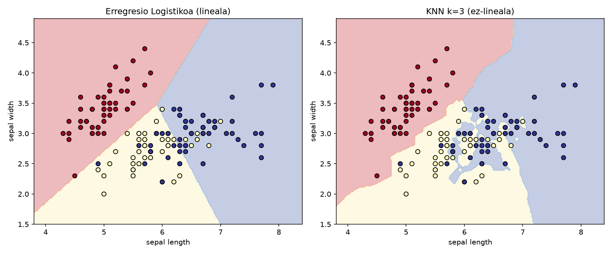

# Sailkapen Txostena (beteta)

Iris (sepal length + width, 150 lagin): **Erregresio Logistikoa** vs **KNN (K=3)**.
Kodea: [`iris_logreg_knn.py`](iris_logreg_knn.py) (exekutatuta 2026-10-01).

## 1. Helburua

Sailkatzaile linealaren eta ez-linealaren portaera alboz albo alderatzea.

## 2. Emaitzak eta Zehaztasuna

**Accuracy de entrenamiento:** ambos modelos se ajustan y evalúan con las
mismas 150 flores, usando solo dos atributos. No hay holdout ni CV; la tabla
describe el ajuste de la muestra y no demuestra rendimiento en flores nuevas.
[Preparación, figura y límites](README.md).

| Eredua | Doitasuna (Accuracy) | Muga Mota |
| :--- | :--- | :--- |
| **Erregresio Logistikoa** | **0.8200** | Lineala (Lerro zuzenak) |
| **KNN (K=3)** | **0.8533** | Ez-lineala (Kurbatua) |

## 3. Erabaki-Mugen Analisi Bisuala

### Hausnarketa galderak:

1. **Setosa klasearen banaketa**: Bi ereduek zuzen sailkatzen dute Setosa;
   gainerakoetatik urrun dago planoan (linealki banagarria da sepal
   neurrietan).
2. **Lerro zuzenak vs kurba kurbatuak**: LogReg-ek zuzen banatzen du;
   KNN puntu isolatuetara moldatzen da kurbekin (malgutasun handiagoa,
   tokiko erabakiak).
3. **Overfitting arriskua**: K=1ekin muga bakoitza puntu bakoitzaren inguruan
   ixten da: zarata memoriatzen du, orokortzea kaltetuz (bariantza handia).

## 4. Ondorioak

- Bi ezaugarriekin, KNN (0.8533) LogReg (0.8200) baino accuracy handiagoa
  ematen du **entrenamendu-laginean**; ez da orokortzearen konparaketa.
- Muga linealak interpretagarriagoak; kurbatuak malguagoak baina
  overfittingerako joerakoak K txikiekin.
