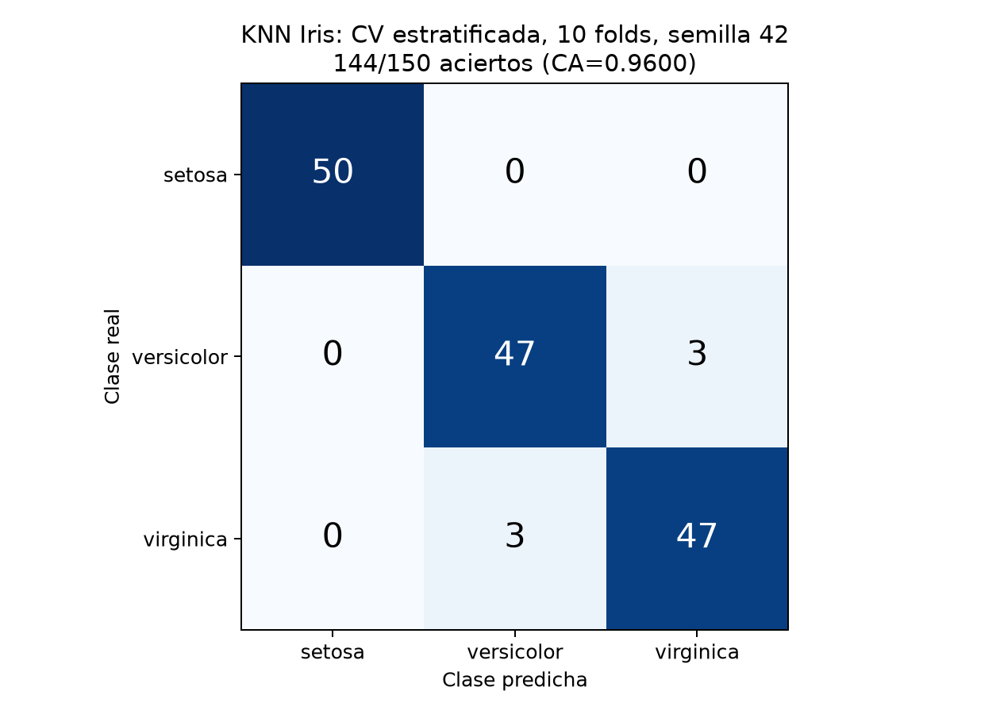
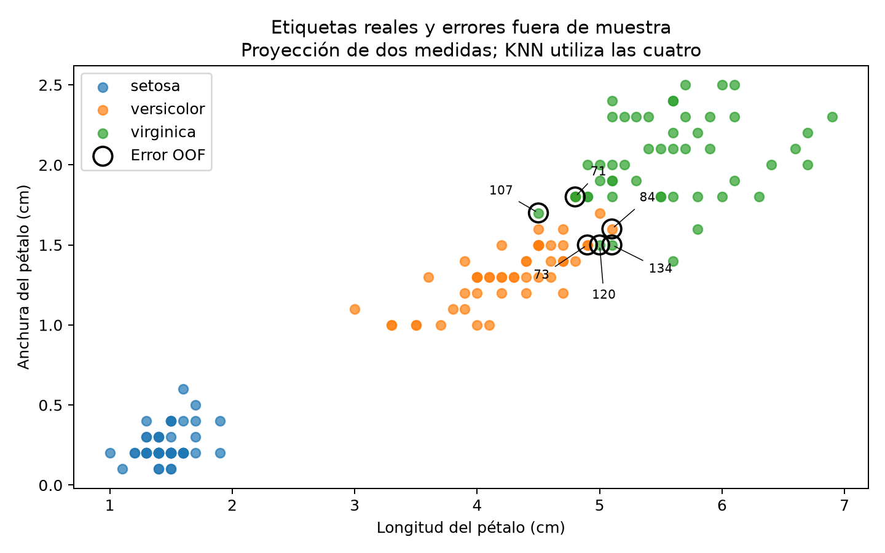

# KNN con Iris: evaluación reproducible y conclusiones

Asignatura 5072, assign 63321. Objetivo: evaluar KNN con las cuatro medidas de Iris mediante predicciones fuera de muestra y conservar la correspondencia entre cada flor, su especie real y su predicción.

## Datos y configuración

[iris.csv](datos/iris/iris.csv) contiene 150 flores, cuatro atributos numéricos en centímetros y tres clases con 50 ejemplos cada una: setosa, versicolor y virginica. El script comprueba igualdad exacta de medidas y etiquetas con `sklearn.datasets.load_iris()`.

KNN utiliza k=3, distancia euclídea, votos uniformes y las cuatro medidas originales, sin escalado. Orange aplica sus preprocesadores predeterminados dentro de cada fold: HasClass, Continuize, RemoveNaNColumns y SklImpute. La entrada no contiene valores ausentes. Se realiza CV estratificada de 10 folds con mezcla y semilla 42; cada fila se evalúa exactamente una vez usando un modelo que no la ha visto al entrenar. Se utiliza la semilla interna de Test & Score en Orange 3.40.0.

## Ejecutar desde la raíz del repositorio

Dependencias: Orange3 3.40.0, scikit-learn 1.9.1, NumPy 2.3.5 y Matplotlib. La ejecución verificada usa Python 3.13.13 del entorno Orange ya instalado, sin modificarlo:

```bash
/home/tears/.local/share/uv/tools/orange3/bin/python \
  03_ML_5072/soluzioak/knn_iris_reproducir.py
uv run --no-project --with reportlab python \
  03_ML_5072/soluzioak/knn_iris_pdf.py
```

El primer comando regenera [predicciones](datos/iris/iris_knn_predicciones.csv), [métricas y trazabilidad](datos/iris/knn_iris.json) y las dos figuras. El segundo regenera [el PDF](Orange_KNN_Iris.pdf) a partir del JSON y las figuras. Los comandos sobrescriben esos resultados locales. `row_id` identifica la posición original (1 a 150); `fold` registra el grupo de evaluación (1 a 10). Las probabilidades se exportan junto a la predicción y el indicador `acierto`.

## Resultados de la ejecución local del 2 de octubre de 2026

- CA/accuracy: **0,9600 (144/150)**; 6 errores.
- F1 macro y ponderado: **0,9600**.
- Precisión/recall/F1: setosa 1,00; versicolor 0,94; virginica 0,94.
- Filas con error: **71, 73, 84, 107, 120 y 134**.

| Real / predicha | setosa | versicolor | virginica |
| --- | ---: | ---: | ---: |
| setosa | 50 | 0 | 0 |
| versicolor | 0 | 47 | 3 |
| virginica | 0 | 3 | 47 |





La segunda figura muestra etiquetas reales en una proyección de dos medidas; el modelo usa cuatro. Los círculos negros y números identifican los seis errores OOF. La proyección ayuda a explorar ejemplos cercanos, pero no demuestra la causa de cada error ni representa la frontera de decisión del modelo completo.

## Corrección y comprobaciones

El exportado anterior contenía 90/150 etiquetas reales incompatibles con las medidas de su fila. Orange devuelve los resultados agrupados por folds; emparejar `data.X` en orden original con `results.actual` o `results.predicted` sin usar `results.row_indices` rompe la asociación. El script coloca predicciones, probabilidades y folds en sus filas originales mediante esos índices, y comprueba que `results.actual == data.Y[results.row_indices]`.

Tras escribir el CSV lo vuelve a leer y verifica cada `row_id`, medidas, etiqueta y `acierto`. También verifica la partición contra `StratifiedKFold` de scikit-learn y comprueba que cada fila se evalúa una sola vez, sin intersección entre entrenamiento y evaluación de cada fold. Resultado: **0/150 desalineaciones**. El JSON registra versiones, hashes SHA-256 de entrada y exportado, configuración y métricas calculadas. El CSV fuente no se modifica.

La CA previa 0,9533 y las comparaciones con otros k se sustituyen por esta ejecución documentada. No se ha repetido una selección de hiperparámetros; escoger k después de comparar CV requeriría una evaluación independiente del proceso de selección.

## Workflow y límites de validación

[Orange_KNN_Iris.ows](Orange_KNN_Iris.ows): File → Test & Score; kNN → Test & Score → Confusion Matrix + Data Table. Para abrirlo:

```bash
orange-canvas 03_ML_5072/soluzioak/Orange_KNN_Iris.ows
```

Si File no resuelve la ruta, selecciona `datos/iris/iris.csv` desde `soluzioak`; confirma cuatro atributos numéricos e `iris` como clase. Configura k=3, distancia euclídea, peso uniforme y CV estratificada de 10 folds. El workflow se ha corregido para usar la clase `OWKNNLearner` existente y `n_folds=3`, que es el índice correspondiente a 10 folds en Orange 3.40. Se ha comprobado su estructura y configuración mediante código.

**Validación realizada:** ejecución real de la API Python de Orange, verificaciones de filas y folds, figuras calculadas y PDF renderizado para revisión visual. **Límite:** estas figuras no son capturas de la GUI; no se afirma que se haya ejecutado interactivamente el workflow. Los resultados dependen del protocolo y las versiones registradas y no sustituyen una evaluación en datos externos.

La [práctica visual LogReg/KNN](Iris_LogReg_KNN/README.md) usa dos atributos y accuracy de entrenamiento; responde a otra pregunta y no es comparable directamente con esta CV.
