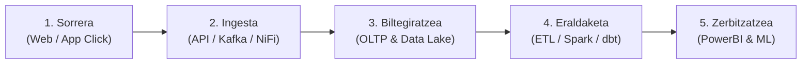

# Ariketak 01_02: Datuen Ingeniaritza - Ebazpen Osoa

Modulua: **Datuen Ingeniaritza eta Arkitektura**  
Fitxategi iturria: `Ariketak_01_02_datuen_ingeniaritza.docx`

---

## 1. Datuen bizi-zikloa identifikatu

Adierazi egoera bakoitza zein faserekin lotzen den:  
*(Sorrera, Ingesta, Biltegiratzea, Eraldaketa, Zerbitzatzea/Kontsumoa)*

| Egoera | Bizi-zikloko Fasea | Arrazoibidea |
|---|---|---|
| **Tenperatura-sentsore batek 5 segundoan behin neurketa bat egiten du.** | **Sorrera (Generation)** | Datu gordin berri bat sortzen da fisiko/digital eremuan. |
| **Apache NiFi-k CSV fitxategiak zerbitzari batetik Data Lake batera eramaten ditu.** | **Ingesta (Ingestion)** | Datuak jatorritik helmuga zentralera mugitzen eta transferitzen dira. |
| **Datuak MongoDB batean gordetzen dira.** | **Biltegiratzea (Storage)** | Datuak euskarri batean persistitzen dira etorkizuneko erabilerarako. |
| **"Eibar " balioa "Eibar" bihurtzen da.** | **Eraldaketa (Transformation)** | Garbiketa (Data Cleaning) eta espazioen kentzea (`trim/strip`). |
| **Power BI-k salmenten dashboard bat erakusten du.** | **Zerbitzatzea / Kontsumoa (Consumption)** | Erabiltzaileak informazioa aztertu eta bistaratzen du. |
| **Web zerbitzari batek erabiltzaile baten eskaera log batean erregistratzen du.** | **Sorrera (Generation)** | Erabiltzailearen ekintzaren erregistro berri bat sortzen da. |
| **Bi CSV fitxategitako bezeroen informazioa bateratzen da.** | **Eraldaketa (Transformation)** | Integrazioa eta bateratzea (*Join / Merge*). |
| **Machine Learning eredu batek prestatutako datuak erabiltzen ditu.** | **Zerbitzatzea / Kontsumoa (Consumption)** | Datuak balio sortzeko edo inferentziak egiteko baliatzen dira. |

---

## 2. Datu baten bidaia: Online denda bateko erosketa

> *Online denda batean bezero batek produktu bat erosten du.*  
> *Azaldu datu horrek egin dezakeen ibilbidea 5 faseak aplikatuz.*

1. **Sorrera (Generation):**
   - *Non sortzen da?* Bezeroak webgunean edo mugikorreko app-ean "Ordaindu" botoia sakatzen duenean. Nabigatzaileak HTTP POST eskaera bat bidaltzen du JSON formatuan (bezero_id, produktu_id, kopurua, helbidea, ordainketa-metodoa, ordua).
2. **Ingesta (Ingestion):**
   - *Nola eramaten da?* API Gateway batek transakzioa jasotzen du. Aldi berean, mezularitza-sistema batera (adib. Apache Kafka edo AWS Kinesis) bidaltzen da gertaera gisa (*event streaming*), beste sistema guztiek (inbentarioa, logistika, analitika) modu asinkronoan jaso dezaten.
3. **Biltegiratzea (Storage):**
   - *Non gordetzen da?* 
     - Berehalakoan: PostgreSQL edo MariaDB transakzionalean (OLTP) erregistratzen da eskaera gisa, ACID bermearekin.
     - Epe luzera: Ekitaldi gordina Data Lake-ko *Bronze* eremuan (Amazon S3 edo MinIO) artxibatzen da JSON/Parquet moduan.
4. **Eraldaketa (Transformation):**
   - *Zer transformazio egiten zaio?* ETL / ELT pipeline batek (Apache NiFi edo dbt bidez) datua hartzen du:
     - Datu pertsonal sentikorrak anonimizatu edo tokenizatu egiten dira (GDPR).
     - Produktuaren katalogoko datuekin eta bezeroaren profilarekin elkartzen da (*Enrichment*).
     - Zergen kalkulua eta marjina kalkulatzen dira.
     - Datu-biltegi analitikora (*Gold* geruza / Data Warehouse) kargatzen da izar-eskeman (*Star Schema*).
5. **Zerbitzatzea / Kontsumoa (Serving):**
   - *Nork erabiliko du azkenean?*
     - **Finantza- eta salmenta-taldeak:** Power BI bidez eguneko diru-sarrerak ikusteko.
     - **Machine Learning ereduak:** Bezeroaren saskia aztertu eta hurrengo produktua gomendatzeko (*Next-Best-Action*).
     - **Logistika:** Biltegiko robotek eskaera prestatu eta bidalketa etiketatzeko.

---

## 3. Hardware fisikoa: zer aukeratuko zenuke? (HDD, SSD, RAM)

| Egoera | Hautapena | Justifikazioa |
|---|---|---|
| **Duela 5 urteko backup-ak, ia inoiz erabiltzen ez direnak.** | **HDD** (Edo Tape/Cold Storage) | Segundoko kostua oso baxua da eta edukiera handia eskaintzen du; irakurketa-abiadura ez da kritikoa hemen. |
| **Une honetan aplikazio batek etengabe erabiltzen dituen datuak cachean gordetzea.** | **RAM** | Latenzia minimoa behar da (nanosegundoak). Redis edo Memcached RAM-en exekutatzen dira abiadura maximoa lortzeko. |
| **Ordenagailu bateko sistema eragilea eta egunero erabiltzen diren aplikazioak.** | **SSD (NVMe)** | Ausazko irakurketa/idazketa (IOPS) oso azkarra behar da sistema eragilea eta programak arin ibil daitezen. |
| **10 TB-ko artxibo historikoa, urtean behin kontsultatzen dena.** | **HDD** | 10 TB SSD-n gordetzea garestiegia litzateke urtean behin bakarrik irakurtzeko. |
| **Segundo bakoitzean milaka aldiz kontsultatzen den aldi baterako informazioa.** | **RAM** | Milaka kontsulta segundoko I/O botila-lepoa sortuko luke disko mekanikoetan zein SSD arruntetan; RAM-ak soilik jasaten du karga hori. |

---

## 4. Biltegiratze-abstrakzio egokia aukeratu

*(Data Warehouse, Data Lake, Data Lakehouse, Cache)*

1. *Enpresa batek azken 10 urteetako salmenta egituratuak aztertu nahi ditu OLAP kontsultekin.*  
   👉 **Data Warehouse (DWH):** Datuak guztiz egituratuak dira eta SQL bidezko agregazio azkarrak behar dira.
2. *Enpresa batek PDF, JSON, CSV, bideo, audio eta log gordinak gorde nahi ditu.*  
   👉 **Data Lake:** Formatuan mugarik gabe eta era gordinean merke biltegiratzeko aukera bakarra da.
3. *Industria batek IoT datu gordinak gorde nahi ditu, baina aldi berean analitika aurreratua egin eta datuak modu kontrolatuan kudeatu.*  
   👉 **Data Lakehouse:** Data Lake baten kostu merkea eta biltegiratze masiboa uztartzen ditu Data Warehouse baten ACID fidagarritasunarekin eta gobernantzarekin.
4. *Web-aplikazio batek erabiltzaileek etengabe kontsultatzen duten informazioa milisegundotan itzuli behar du.*  
   👉 **Cache (In-memory Storage):** Erantzun-denbora milisegundo azpikoa bermatzeko (adib. Redis).

---

## 5. Kasu praktikoa: “Smart Factory”

> *Fabrika batek 500 IoT sentsore ditu (tenperatura, bibrazioa, energia). Segundo gutxian behin sortzen dira. Uneko datuak oso azkar kontsultatu behar dira; eta 5 urteko datuak gorde nahi dira joeretarako.*

### 1. Non sortzen dira datuak?
Lantegiko makinen osagai mekaniko eta elektrikoetan instalatutako **IoT sentsoreetan eta PLC (Kontrolagailu Logiko Programagarrietan)**.

### 2. Bost faseetako adibide bana:
- **Sorrera:** Torloju-makinaren bibrazio-sentsoreak ardatzaren oszilazio-neurketa bat hartzea (adib. `4.2 mm/s`).
- **Ingesta:** MQTT broker (Mosquitto) baten bidez sentsorearen datuak sare industrialetik enpresako mezularitza-sistemara garraiatzea.
- **Biltegiratzea:** Datuak denbora-serieetako datu-base batean (adib. InfluxDB) gordetzea uneko kontsultetarako, eta Parquet fitxategietan Data Lakehouse batean (MinIO + Iceberg) epe luzerako.
- **Eraldaketa:** Datu zaratatsuak iragaztea, galdutako neurketen interpolazioa egitea eta minutuko batez bestekoak (*moving average*) kalkulatzea.
- **Zerbitzatzea:** Mantentze-teknikariak lantegiko pantailan (Grafana dashboard) alarma gorria ikustea bibrazio altuagatik.

### 3. Datu historiko guztietarako zer biltegiratze-abstrakzio proposatuko zenuke?
**Data Lakehouse** (adibidez, *MinIO Object Storage* + *Apache Parquet* formatua + *Delta Lake / Iceberg* taula-formatua).
- **Zergatik?** 500 sentsorek 5 urtetan petabyte-ak sor ditzakete. Data Warehouse tradizional batean mantentzea garestiegia litzateke; Lakehouse batek biltegiratze merkea eskaintzen du, baina SQL kontsultak eta Machine Learning ereduak zuzenean exekutatzeko ahalmena mantenduz.

### 4. Zer transformazio egin dakieke sentsoreen datuei?
- **Outlier-ak eta zarata kentzea:** Sentsoreen deskonexioek sortutako balio absurdoak (adib. 9999 °C edo -999) garbitu.
- **Datuen agregazio tenporala (Resampling/Downsampling):** Segundoko datuetatik abiatuta, orduko edo eguneko batez bestekoak, minimoak eta maximoak kalkulatu 5 urteko joerak arin aztertzeko.
- **Unitate-normalizazioa:** Fahrenheit-etik Celsius-era bihurtu, edo bibrazio-maiztasunak Fourier-en transformatuaren bidez (FFT) espektro-eremura pasatu.
- **Feature Engineering:** Makina bakoitzaren *gainberotze-tasa* edo *etengabeko lan-orduak* kalkulatu.

### 5. Nork edo zerk kontsumituko lituzke datuak?
- **Gizakiek:** Mantentze-lanetako ingeniariek, plantako arduradunek eta eraginkortasun energetikoko auditoreek (Dashboards bidez).
- **Makinek / Algoritmoek:** Mantentze-lan prediktiboko ereduek (*Predictive Maintenance AI*), matxura gertatu baino 48 ordu lehenago piezak aldatzeko agindua automatikoki sortuz.

---

## 6. Datuen irenstea eta ETL

### 1. Zein da kontuan hartu beharreko lehen urratsa pipeline bat diseinatzean?
**Iturburuko datuen izaera eta negozio-eskakizunak (SLA) ulertzea:**  
Datuak zein formatutan dauden, zein maiztasunekin iristen diren (Batch ala Streaming), zenbat balio duten, eta helmugan zein latentzia onartzen den (segundokoa ala egunerokoa).

### 2. Zer erlazio dago datu-pipeline eta ETL artean?
- **Datu-pipeline-a** kontzeptu orokorra da: datuak jatorri batetik helmuga batera eramateko edozein fluxu automatizatu da.
- **ETL (Extract, Transform, Load)** datu-pipeline mota espezifiko bat da, non datuak bidean eraldatzen diren helmugan kargatu aurretik. Pipeline guztiak ez dira ETL (adibidez erreplika hutsak daude, edo ELT fluxuak).

### 3. ETL eta ELT gauza bera al dira? Noiz egiten da bakoitza?
Ez dira gauza bera:
- **ETL:** Datuak atera -> Bitarteko zerbitzari batean eraldatu -> Prest kargatu helmugan.  
  *Noiz erabili?* Datu sentikorrak (GDPR, bankuak) helmugara iritsi aurretik anonimizatu behar direnean, edo helmugako datu-baseak prozesatzeko ahalmen txikia duenean.
- **ELT:** Datuak atera -> Gordinik kargatu helmugan -> Helmugako motorraren bidez eraldatu.  
  *Noiz erabili?* Cloud Data Warehouses (Snowflake, BigQuery) edo Data Lakehouse-ak daudenean, datu gordinak beti eskura gorde nahi direnean.

### 4. Big Data testuinguruan, zein da nagusi (ETL ala ELT)? Zergatik?
**ELT da nagusi gaur egun.**  
Hiru arrazoi nagusiengatik:
1. **Cloud biltegiratze merkea:** Datu gordin guztiak gordetzea merkea da.
2. **Konputazio-motor banatuen ahalmena:** Cloud plataformen (Snowflake, Databricks, BigQuery) prozesatze-ahalmena infinituki eskalagarria da eta SQL/Python bidez eraldaketak askoz azkarrago egiten dituzte ETL tresna tradizional batek baino.
3. **Malgutasuna:** Behin datu gordina gordeta, etorkizunean eraldaketa berriak egin daitezke datuak berriro eskatu gabe.

---

## 7. ETL ala ELT? (Kasuak)

| Kasua | ETL ala ELT? | Justifikazioa |
|---|---|---|
| **CSV fitxategi bat irakurri, datu okerrak zuzendu eta ondoren Data Warehouse batean gordetzen da.** | **ETL** | Datuak garbitu eta transformatu egiten dira DWH-an kargatu **aurretik**. |
| **IoT sentsoreen datu gordinak zuzenean Data Lake batean gordetzen dira. Gero, Spark erabiliz garbitu eta agregatzen dira.** | **ELT** | Datuak lehenik gordinik kargatzen dira (Load) eta ondoren Spark-ekin eraldatzen dira (Transform). |
| **MariaDB-ko datuak atera, NiFi-n eraldatu eta MongoDB-n gordetzen dira.** | **ETL** | Apache NiFi-k bidean transformatzen ditu datuak helmugan idatzi aurretik. |
| **JSON eta CSV fitxategiak aldaketarik gabe Data Lake batera eramaten dira. Ondoren, SQL bidez analisirako prestatzen dira.** | **ELT** | Datuak aldatu gabe kargatzen dira lehenik; transformazioa ondoren egiten da SQL bidez. |
| **Salmenten datuak Python bidez garbitu, bezeroen datuekin elkartu eta azken emaitza Parquet formatuan gordetzen da.** | **ETL** | Transformazioa (garbiketa eta join) memorian/bidean egiten da, eta emaitza eraldatua gordetzen da fitxategian. |

---

## 8. Non daude E, T eta L?

1. **Extract (E):** Iturburuko sistemetatik (APIak, transakzio-datu-baseak, CSV/JSON fitxategiak) datuak irakurtzea eta eskuratzea.
2. **Transform (T):** Datuak garbitzea, datu-motak zuzentzea, iragazkiak aplikatzea, taulak elkartzea (*joins*) eta metrikak kalkulatzea.
3. **Load (L):** Eraldatutako emaitzak behin betiko biltegira (DWH, Data Lakehouse, datu-base analitikoa) idaztea.
4. **Zer aldatuko litzateke prozesua ELT izango balitz?**  
   Datuak iturburutik atera bezain laster (E), zuzenean helmugako biltegira idatziko lirateke (L) formatu gordinean (*raw data*). Ondoren, datu-base analitikoaren barruko prozesuek (adib. dbt ereduak edo SQL prozedurak) egingo lukete transformazioa (T).

---

## 9. ETL prozesua diseinatu: Eibarko bezeroen salmentak

> *Fitxategiak: `salmentak.csv` eta `bezeroak.csv`.*  
> *Helburua: Eibarko bezeroen salmenta guztien zenbatekoa kalkulatu.*

### Pipeline-aren diseinua:

#### 1. E – Extract (Datuak eskuratu):
- Irakurri `salmentak.csv` (zutabeak: `salmenta_id`, `bezero_id`, `produktua`, `zenbatekoa`, `data`).
- Irakurri `bezeroak.csv` (zutabeak: `bezero_id`, `izena`, `herria`, `posta_kodea`).
- Datu-iturriak memorian kargatu (adib. Python Pandas DataFrame gisa).

#### 2. T – Transform (Eraldaketa):
1. **Datuen garbiketa:**
   - Egiaztatu `bezero_id` zutabea bietan datu-mota berekoa dela (adibidez osoko zenbakia / `int`).
   - Garbitu `zenbatekoa` zutabea: moneta ikurrak kendu (€), komak puntuetara pasa eta zenbaki erreal (`float`) bihurtu.
   - Garbitu `herria` zutabea: espazioak kendu eta letra xeheetara bihurtu (`strip().lower()`).
2. **Integrazioa (Join):**
   - Egin *Inner Join* bi datu-multzoen artean `bezero_id` gakoa erabiliz.
3. **Iragazketa:**
   - Aplikatu baldintza: `herria == 'eibar'`.
4. **Agregazioa:**
   - Kalkulatu Eibarko bezeroen salmenten batura: `totala = df_eibar['zenbatekoa'].sum()`.

#### 3. L – Load (Karga eta emaitza):
- Emaitza txosten edo fitxategi egituratu batean gorde (adibidez: `data/eibarko_salmentak_laburpena.csv` edo json batean: `{"herria": "Eibar", "salmenta_zenbateko_totala": totala}`).
- Zuzendaritzaren datu-base analitikora edo Power BI-ren taula agregatura txertatu.
