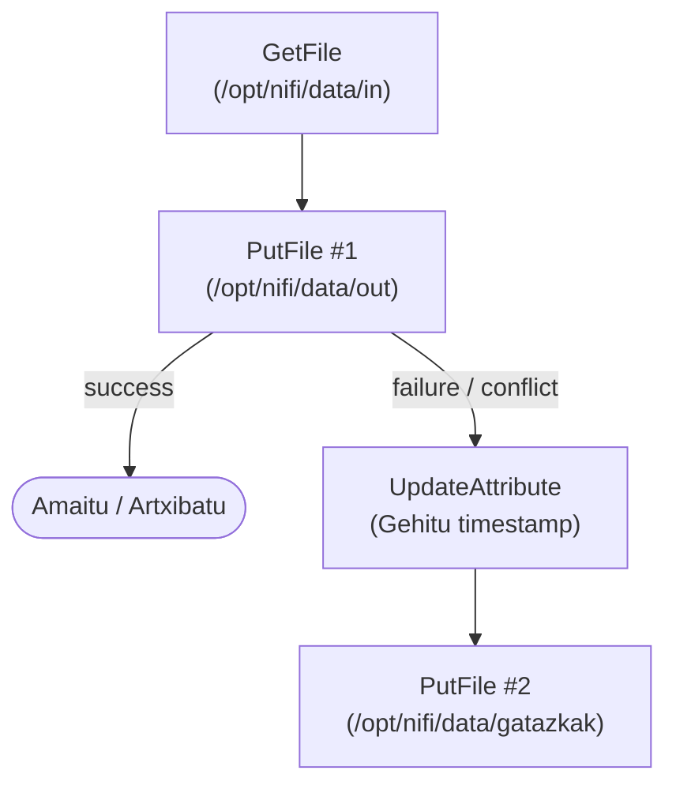
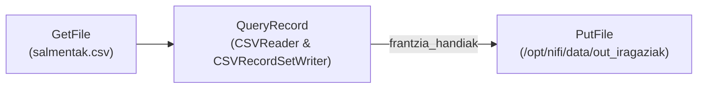
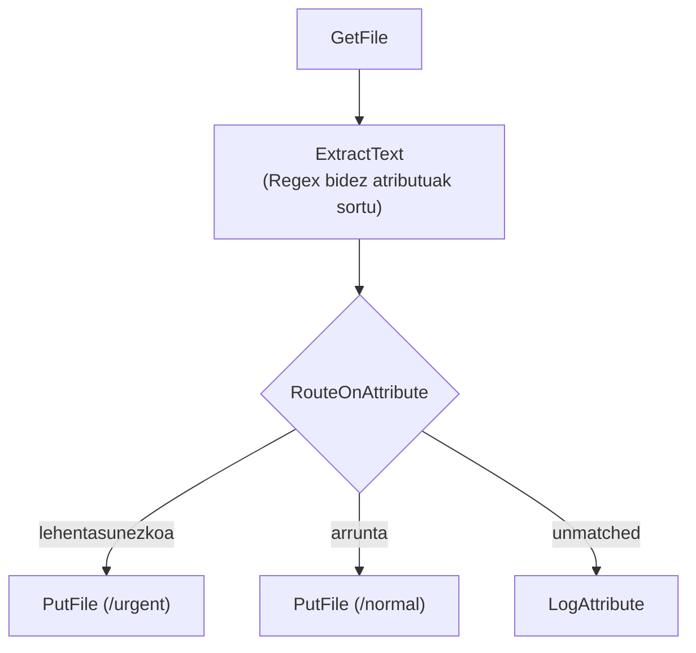
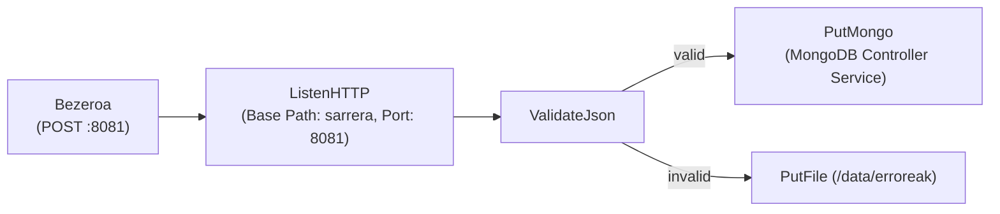

# Apache NiFi: Kasu Praktikoak 1, 2, 3 eta 4 - Ebazpen eta Konfigurazio Gida

Gai-arloa: **DataFlow, Ingesta eta Apache NiFi**  
Iturria: `GIDA Apache NiFi instalazioa eta kasu praktikoak 1-2-3-4.pdf`

---

## 1. Kasua: Fitxategiak mugitu eta Gatazkak kudeatu

### Helburua
Fitxategiak sarrera-direktorio batetik (`in`) irteera-direktorio batera (`out`) eramatea. Helmugan izen bereko fitxategi bat badago (gatazka), fitxategia ez da gainidatziko: denbora-zigiluarekin (*timestamp*) berrizendatu eta gatazka-direktoriora bideratuko da.



### Konfigurazioa:
1. **`GetFile`:**
   - `Input Directory`: `/opt/nifi/data/in`
   - `Keep Source File`: `false` (fitxategia mugitu, ez kopiatu)
   - `File Filter`: `.*`
2. **`PutFile #1`:**
   - `Directory`: `/opt/nifi/data/out`
   - `Conflict Resolution Strategy`: `fail` (izen bera badago, porrot egin)
3. **`UpdateAttribute` (Gatazkak kudeatzeko):**
   - Property berria gehitu: `filename`
   - Balioa (NiFi Expression Language):
     `${filename:substringBeforeLast('.')}_${now():format('yyyyMMdd_HHmmss')}.${filename:substringAfterLast('.')}`
4. **`PutFile #2`:**
   - `Directory`: `/opt/nifi/data/gatazkak`
   - `Conflict Resolution Strategy`: `replace`

---

## 2. Kasua: CSV datuak iragazi (`salmentak.csv`)

### Helburua
`salmentak.csv` fitxategia irakurri eta **Frantziako salmentak unitate 1 baino gehiago** dituzten erregistroak soilik iragaztea (`Country = 'France' AND Units > 1`).

### Prozesatutako emaitza (Ikus `salmentak_iragaziak.csv`):
```csv
ProductID;Date;Zip;Units;Revenue;Country
850;2/03/1999;75000;3;245.0;France
725;4/12/1999;75008;5;577.5;France
850;6/30/1999;69001;4;392.0;France
```

### Konfigurazio optimizatua (Aldaera 3: SplitRecord gabe):


1. **Controller Services definitu:**
   - **`CSVReader`:**
     - `Treat First Line as Header`: `true`
     - `Value Separator`: `;`
   - **`CSVRecordSetWriter`:**
     - `Value Separator`: `;`
     - `Include Header Line`: `true`
2. **`QueryRecord` Processor:**
   - `Record Reader`: `CSVReader`
   - `Record Writer`: `CSVRecordSetWriter`
   - Propietate dinamiko berria (`frantzia_handiak`):
     ```sql
     SELECT * FROM FLOWFILE 
     WHERE TRIM(Country) = 'France' AND CAST(Units AS INT) > 1
     ```
3. **`PutFile`:**
   - `Directory`: `/opt/nifi/data/out_iragaziak`
   - `Conflict Resolution Strategy`: `replace`

---

## 3. Kasua: Atributuak, Bideraketa eta Datuen Linajea

### Helburua
FlowFile-en edukitik informazioa atera eta metadatu (atributu) bihurtzea, eta atributu horien arabera bide desberdinetatik bidaltzea (*RouteOnAttribute*).



### Konfigurazioa:
1. **`ExtractText`:**
   - Gehitu eremuak regex bidez, adib. `bezero_mota`: `bezero_mota=([A-Z]+)`
2. **`RouteOnAttribute`:**
   - `lehentasunezkoa`: `${bezero_mota:equals('VIP')}`
   - `arrunta`: `${bezero_mota:equals('ESTANDAR')}`
3. **Data Provenance (Linajea ikustea):**
   - NiFi UI-an: Egin klik eskuineko botoiarekin processor-ean -> **View Data Provenance**.
   - Ikusi gertaerak (`CREATE`, `ATTRIBUTES_MODIFIED`, `ROUTE`, `DROP`). Horrela ziurtatzen da auditoretza eta trazabilitatea.

---

## 4. Kasua: HTTP bidezko sarrera eta MongoDB biltegiratzea

### Helburua
HTTP POST bidez mezuak jaso eta erroreak MongoDBn gorde. Beheko eskema
**aldaera kontzeptual bat** da; biltegiko benetako
[`flow_04_mongodb_http.json`](04_HTTP_Ingesta_eta_MongoDB/flow_04_mongodb_http.json)
fluxuak `RouteOnContent`, `MergeContent`, `ExtractText`, `UpdateAttribute` eta
`AttributesToJSON` erabiltzen ditu. Bere konfigurazio eta muga zehatzak
[`README`](04_HTTP_Ingesta_eta_MongoDB/README.md) horretan daude.



### Konfigurazioa:
1. **`ListenHTTP`:**
   - `Base Path`: `sarrera`
   - `Listening Port`: `8081`
2. **`ValidateJson`:**
   - Egiaztatu FlowFile-aren edukia JSON baliagarria dela.
3. **`PutMongo` (aldaera kontzeptuala):**
   - MongoDB Controller Service: laborategiko MongoDB konexioa; kredentzialak
     `.env`-etik, inoiz ez dokumentuan finkatuta.
   - `Mongo Database Name` eta `Mongo Collection Name`: erabiltzen den fluxuaren
     balioekin bat etorri behar dute. Biltegiko fluxuak `iabd` / `4kasua` darabil.
   - `Mode`: `insert`; berriro bidalitako mezuak bikoiztu daitezke.
4. **Proba komandoa (aldaera hau martxan eta 8081 ataka irisgarri bada soilik):**
   ```bash
   docker exec iabd-nifi curl -sS -X POST -H "Content-Type: application/json" \
        -d '{"erabiltzailea": "unai", "ekintza": "login", "data": "2026-09-21"}' \
        http://localhost:8081/sarrera
   ```
   `8081` ataka ez dago hostean argitaratuta. Komando honek ez du biltegiko
   benetako fluxua frogatzen: hark `/iabd` bidea eta `ERROR` edukia behar ditu,
   eta ondorioa MongoDBn egiaztatu behar da. Ikus kasuaren READMEa.
