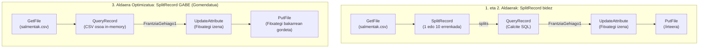

# NiFi 2. Kasua: CSV Datuak Iragazi (Caso 2 - 3 Variantes)

> **Modulua / Gai-arloa:** Big Data Aplikatua · 01 DataFlow · Apache NiFi  
> **Fitxategi Nagusiak:**
> - [`flow_02_csv_datuak_iragazi_aldaera1.json`](file:///home/tears/bigdata/soluzioak/03_DataFlow_Apache_NiFi/02_CSV_Datuak_Iragazi/flow_02_csv_datuak_iragazi_aldaera1.json) (1. Aldaera: SplitRecord 1)
> - [`flow_02_csv_datuak_iragazi_aldaera2.json`](file:///home/tears/bigdata/soluzioak/03_DataFlow_Apache_NiFi/02_CSV_Datuak_Iragazi/flow_02_csv_datuak_iragazi_aldaera2.json) (2. Aldaera: SplitRecord 10)
> - [`flow_02_csv_datuak_iragazi_aldaera3_optimizazioa.json`](file:///home/tears/bigdata/soluzioak/03_DataFlow_Apache_NiFi/02_CSV_Datuak_Iragazi/flow_02_csv_datuak_iragazi_aldaera3_optimizazioa.json) (3. Aldaera: Optimizatua)
> - **Simulazio Scripta:** [`simulatu_kasu_2_salmentak.py`](file:///home/tears/bigdata/soluzioak/03_DataFlow_Apache_NiFi/02_CSV_Datuak_Iragazi/simulatu_kasu_2_salmentak.py)  
> **Iturria:** `GIDA Apache NiFi instalazioa eta kasu praktikoak 1-2-3-4.pdf` (13–26 orr.)

---

## 1. Helburua (Objetivo)

`salmentak.csv` fitxategiko salmenta-erregistroak iragaztea, soilik **Frantziako salmentak eta unitate 1 baino gehiago** dituzten erregistroak mantenduz:
$$\text{Country} = \text{'France'} \quad \text{ETA} \quad \text{Units} > 1$$

### Sarrerako datuak (`salmentak.csv`):
```csv
ProductID;Date;Zip;Units;Revenue;Country
725;1/15/1999;41540;1;115.5;Germany
850;2/03/1999;75000;3;245.0;France       <-- BETETZEN DU (France, 3 > 1)
425;3/21/1999;28013;1;87.25;Spain
725;4/12/1999;75008;5;577.5;France       <-- BETETZEN DU (France, 5 > 1)
910;5/05/1999;10115;2;230.0;Germany
850;6/30/1999;69001;4;392.0;France       <-- BETETZEN DU (France, 4 > 1)
```

### Irteerako emaitza (`salmentak_iragaziak.csv`):
```csv
ProductID;Date;Zip;Units;Revenue;Country
850;2/03/1999;75000;3;245.0;France
725;4/12/1999;75008;5;577.5;France
850;6/30/1999;69001;4;392.0;France
```

---

## 2. Hiru Aldaeren Arkitektura eta Konparaketa



### Konparaketa Teknikoa:

| Ezaugarria | 1. Aldaera (SplitRecord 1) | 2. Aldaera (SplitRecord 10) | 3. Aldaera Optimizatua (SplitRecord gabe) |
| :--- | :--- | :--- | :--- |
| **Sortutako FlowFile kopurua** | $N$ FlowFile (errenkada bakoitzeko 1) | $\lceil N/10 \rceil$ FlowFile | **FlowFile bakarra** |
| **Errendimendua / CPU** | Baxua (gainkarga handia ilaretan) | Ertaina | **Oso handia** (in-memory streaming) |
| **Irteerako fitxategiak** | Fitxategi txiki bat emaitza bakoitzeko | Multzokatutako fitxategiak | **CSV fitxategi bakar garbia** |
| **Produkzioko baliozkotasuna** | Ez da gomendagarria datu handiekin | Erabilgarria mikro-batching-ean | **Estandar profesionala (Record API)** |

---

## 3. Kontroladore Zerbitzuak (Controller Services)

Bi zerbitzu hauek prozesu-taldearen barruan txertatuta daude fluxu-fitxategietan:

1. **`CSVReader` (`org.apache.nifi.csv.CSVReader`):**
   - `Schema Access Strategy`: `Use String Fields From Header` (edo `csv-header-derived`)
   - `Value Separator`: `;` (puntu eta koma)
   - `Treat First Line as Header`: `true`
2. **`CSVRecordSetWriter` (`org.apache.nifi.csv.CSVRecordSetWriter`):**
   - `Schema Access Strategy`: `Inherit Record Schema`
   - `Value Separator`: `;`
   - `Include Header Line`: `true`

---

## 4. Prozesadoreen Konfigurazio Gakoak

1. **`QueryRecord` (`SQLkontsulta`):**
   - `Record Reader`: `CSVReader`
   - `Record Writer`: `CSVRecordSetWriter`
   - `Include Zero Record FlowFiles`: `false`
   - Propietate Dinamikoa (`FrantziaGehiago1`):
     ```sql
     SELECT * FROM FLOWFILE 
     WHERE TRIM(Country) = 'France' AND CAST(Units AS INT) > 1
     ```
2. **`UpdateAttribute` (`FitxategiaBerrizendatu`):**
   - `filename`: `${filename:substringBeforeLast('.')}_${uuid}_${now():toNumber()}.csv`
3. **`PutFile` (`FitxategiaJarri`):**
   - `Directory`: `/opt/nifi/ariketak/02-ariketa-csv-iragazi/irteera`
   - `Conflict Resolution Strategy`: `replace`

---

## 5. Proba eta Simulazioa

Fluxua exekutatu aurretik edo NiFi gabe egiaztatzeko, Python bidezko simulazio-scripta exekutatu daiteke:
```bash
python3 /home/tears/bigdata/soluzioak/03_DataFlow_Apache_NiFi/02_CSV_Datuak_Iragazi/simulatu_kasu_2_salmentak.py
```
Output-a zuzenean sortuko da `irteera/salmentak_iragaziak.csv` bidean.
