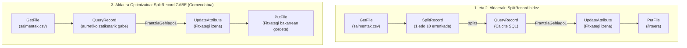

# NiFi 2. Kasua: CSV Datuak Iragazi (Caso 2 - 3 Variantes)

## Ejecución verificada y evidencia

2026-10-02: se ejecutaron las tres variantes con las mismas seis ventas.
SplitRecord=1 creó seis FlowFiles; SplitRecord=10 creó uno; la tercera variante
no tiene SplitRecord. QueryRecord seleccionó las mismas tres ventas en todas;
PutFile escribió 3, 1 y 1 archivos respectivamente. Se comprobó su contenido
contra el predicado `TRIM(Country)='France' AND CAST(Units AS INTEGER)>1`.

La entrada anterior contenía líneas vacías y comentarios `#...` de explicación
que no eran ventas. El lector infería el esquema y fallaba con
`Index for header 'Date' is 1 but CSVRecord only has 1 values!`. Ahora el CSV
contiene solo cabecera y seis filas de datos; las notas del formato quedan en
esta guía. Los servicios usan esquema de texto desde la cabecera y separador
LF real; la consulta convierte Units explícitamente. La ejecución final se
repitió tras limpiar el fixture, evitando contar los comentarios como records.

[Resultado](evidencias/resultado_2026-10-02.json),
[variant1](evidencias/aldaera1/), [variant2](evidencias/aldaera2/),
[variant3](evidencias/aldaera3/) y
[log del diagnóstico](evidencias/nifi_app_extracto.log).
La simulación Python y su archivo previo se conservan como materiales
separados; estos nuevos CSV de evidencia los escribió NiFi. No hay benchmark
CPU/memoria ni ratio de velocidad medido.


> **Modulua / Gai-arloa:** Big Data Aplikatua · 01 DataFlow · Apache NiFi  
> **Fitxategi Nagusiak:**
> - [`flow_02_csv_datuak_iragazi_aldaera1.json`](flow_02_csv_datuak_iragazi_aldaera1.json) (1. Aldaera: SplitRecord 1)
> - [`flow_02_csv_datuak_iragazi_aldaera2.json`](flow_02_csv_datuak_iragazi_aldaera2.json) (2. Aldaera: SplitRecord 10)
> - [`flow_02_csv_datuak_iragazi_aldaera3_optimizazioa.json`](flow_02_csv_datuak_iragazi_aldaera3_optimizazioa.json) (3. Aldaera: Optimizatua)
> - **Simulazio Scripta:** [`simulatu_kasu_2_salmentak.py`](simulatu_kasu_2_salmentak.py)  
> **Iturria:** `GIDA Apache NiFi instalazioa eta kasu praktikoak 1-2-3-4.pdf` (13–26 orr.)

---

## 1. Helburua (Objetivo)

`salmentak.csv` fitxategiko salmenta-erregistroak iragaztea, soilik **Frantziako salmentak eta unitate 1 baino gehiago** dituzten erregistroak mantenduz:
$$\text{Country} = \text{'France'} \quad \text{ETA} \quad \text{Units} > 1$$

### Sarrerako datuak (`salmentak.csv`):
```csv
ProductID;Date;Zip;Units;Revenue;Country
725;1/15/1999;41540;1;115.5;Germany
850;2/03/1999;75000;3;245.0;France       <-- BETETZEN DU (France, 3 > 1)
425;3/21/1999;28013;1;87.25;Spain
725;4/12/1999;75008;5;577.5;France       <-- BETETZEN DU (France, 5 > 1)
910;5/05/1999;10115;2;230.0;Germany
850;6/30/1999;69001;4;392.0;France       <-- BETETZEN DU (France, 4 > 1)
```

### Irteerako emaitza (`salmentak_iragaziak.csv`):
```csv
ProductID;Date;Zip;Units;Revenue;Country
850;2/03/1999;75000;3;245.0;France
725;4/12/1999;75008;5;577.5;France
850;6/30/1999;69001;4;392.0;France
```

---

## 2. Hiru Aldaeren Arkitektura eta Konparaketa


```mermaid
flowchart TD
    subgraph V1["1. eta 2. Aldaerak: SplitRecord bidez"]
        A1["GetFile<br/>(salmentak.csv)"] --> B1["SplitRecord<br/>(1 edo 10 errenkada)"]
        B1 -->|splits| C1["QueryRecord<br/>(Calcite SQL)"]
        C1 -->|FrantziaGehiago1| D1["UpdateAttribute<br/>(Fitxategi izena)"]
        D1 --> E1["PutFile<br/>(/irteera)"]
    end

    subgraph V3["3. Aldaera Optimizatua: SplitRecord GABE (Gomendatua)"]
        A3["GetFile<br/>(salmentak.csv)"] --> C3["QueryRecord<br/>(aurretiko zatiketarik gabe)"]
        C3 -->|FrantziaGehiago1| D3["UpdateAttribute<br/>(Fitxategi izena)"]
        D3 --> E3["PutFile<br/>(Fitxategi bakarrean gordeta)"]
    end
```

### Konparaketa Teknikoa:

| Ezaugarria | 1. Aldaera (SplitRecord 1) | 2. Aldaera (SplitRecord 10) | 3. Aldaera Optimizatua (SplitRecord gabe) |
| :--- | :--- | :--- | :--- |
| **Sortutako FlowFile kopurua** | $N$ FlowFile (errenkada bakoitzeko 1) | $\lceil N/10 \rceil$ FlowFile | **FlowFile bakarra** |
| **Errendimendua / CPU** | Ez neurtua; FlowFile gehiago | Ez neurtua | Ez neurtua; FlowFile gutxiago |
| **Irteerako fitxategiak** | Fitxategi txiki bat emaitza bakoitzeko | Multzokatutako fitxategiak | **CSV fitxategi bakar garbia** |
| **Erabilera didaktikoa** | Banakako erregistroak ikusteko | Loteen eragina aztertzeko | Record APIrekin aurretiko zatiketa saihesteko |

---

## 3. Kontroladore Zerbitzuak (Controller Services)

Bi zerbitzu hauek prozesu-taldearen barruan txertatuta daude fluxu-fitxategietan:

1. **`CSVReader` (`org.apache.nifi.csv.CSVReader`):**
   - `Schema Access Strategy`: `Use String Fields From Header` (edo `csv-header-derived`)
   - `Value Separator`: `;` (puntu eta koma)
   - `Treat First Line as Header`: `true`
2. **`CSVRecordSetWriter` (`org.apache.nifi.csv.CSVRecordSetWriter`):**
   - `Schema Access Strategy`: `Inherit Record Schema`
   - `Value Separator`: `;`
   - `Include Header Line`: `true`

---

## 4. Prozesadoreen Konfigurazio Gakoak

1. **`QueryRecord` (`SQLkontsulta`):**
   - `Record Reader`: `CSVReader`
   - `Record Writer`: `CSVRecordSetWriter`
   - `Include Zero Record FlowFiles`: `false`
   - Propietate Dinamikoa (`FrantziaGehiago1`):
     ```sql
     SELECT * FROM FLOWFILE 
     WHERE TRIM(Country) = 'France' AND CAST(Units AS INT) > 1
     ```
2. **`UpdateAttribute` (`FitxategiaBerrizendatu`):**
   - `filename`: `${filename:substringBeforeLast('.')}_${uuid}_${now():toNumber()}.csv`
3. **`PutFile` (`FitxategiaJarri`):**
   - `Directory`: `/opt/nifi/ariketak/02-ariketa-csv-iragazi/irteera`
   - `Conflict Resolution Strategy`: `replace`

---

## 5. Proba eta Simulazioa

Fluxua exekutatu aurretik edo NiFi gabe egiaztatzeko, Python bidezko simulazio-scripta exekutatu daiteke:
```bash
python3 06_NiFi/soluzioak/02_CSV_Datuak_Iragazi/simulatu_kasu_2_salmentak.py
```
Output-a zuzenean sortuko da `irteera/salmentak_iragaziak.csv` bidean.


## Laboratorio aislado y reproducción

Los comandos siguientes se ejecutan desde la raíz y prueban los casos 1-6 en
una única instancia dedicada. No usan `infra/`, bases de datos personales ni
el canvas de otra instancia. Requieren Docker, Python 3 y las imágenes
`iabd-nifi:2.0.0-local`, `mongo:7.0` y `mysql:8.4`. Si falta la imagen local:

```bash
docker build -t iabd-nifi:2.0.0-local \
  06_NiFi/soluzioak/06_MariaDB_MongoDB_Laborategia_DF2.2
```

```bash
python 06_NiFi/soluzioak/scripts/nifi_lab_stack.py up
python 06_NiFi/soluzioak/scripts/nifi_lab_verificar.py prepare
python 06_NiFi/soluzioak/scripts/nifi_lab_ejecutar.py
python 06_NiFi/soluzioak/scripts/nifi_lab_evidencias.py
python 06_NiFi/soluzioak/scripts/nifi_lab_comparar.py
python 06_NiFi/soluzioak/scripts/nifi_lab_resultados.py
python 06_NiFi/soluzioak/scripts/nifi_lab_validar_evidencias.py
python 06_NiFi/soluzioak/scripts/nifi_lab_stack.py down
```

[Preparador](../scripts/nifi_lab_stack.py): Compose sanitizado embebido,
proyecto `bigdata-nifi-lab-20261002`, red dedicada y endpoint
`https://localhost:18443` publicado solo en loopback. Genera credenciales
aleatorias en `/tmp/bigdata-nifi-lab-20261002/credentials.json` y `.env`, con
modo 600 dentro de un directorio 700; exporta el certificado de NiFi y verifica
TLS y el hostname `localhost`. Ningún secreto entra en Git. No muestra tokens.
MySQL/MongoDB no publican puertos. No se sobreescribe un laboratorio existente.

[Importador](../scripts/nifi_lab_verificar.py) crea un PG propio y remapea
servicios/rutas solo dentro del laboratorio. [Ejecutor](../scripts/nifi_lab_ejecutar.py)
ejecuta SQL y GenerateFlowFile mediante `RUN_ONCE`; GetFile sondea entradas
con `Keep Source File=false` y se detiene al cerrar la prueba. Espera como
máximo diez minutos para
la carga SQL completa (puede necesitar ajuste en otra máquina), evita duplicar la carga SQL si las
colecciones ya tienen documentos y detiene su PG al terminar. Es una prueba
local: modifica solo directorios temporales, grupos y bases de datos del lab.
[Exportador](../scripts/nifi_lab_evidencias.py) guarda estados y provenance
acotado a 100 eventos por procesador; las listas largas de linaje conservan
20 UUID y el conteo total. Liberar resultados de consulta no borra eventos.
[Comparador](../scripts/nifi_lab_comparar.py) coteja todas las filas SQL/Mongo.
[Verificador de resultados](../scripts/nifi_lab_resultados.py) compara y archiva
los archivos reales y los documentos de muestra, sin guardar las filas de clientes.

La receta reúne los pasos ejecutados en esta sesión; no se ha repetido un
segundo arranque completo desde cero con el script conjunto. `down` retira
solo los contenedores y volúmenes del proyecto dedicado y conserva los
archivos temporales del host. Si se comparte con el caso 7, detener primero
su sidecar MinIO y coordinar el cierre. La evidencia versionada permite
[validación sin Docker](../scripts/nifi_lab_validar_evidencias.py).

**Límites:** ejecución real de NiFi por REST, contenido, logs y provenance;
no hay captura GUI. T3 abrió el HTTPS del lab pero no pudo cargar su
certificado en el navegador. La validación REST sí usa certificado verificado.
No se han accedido APIs con claves reales ni AWS.
