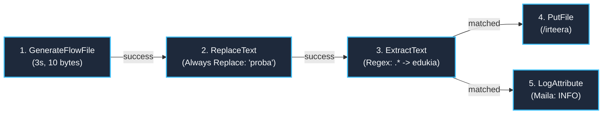
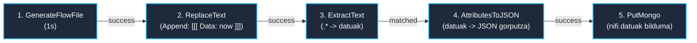

# NiFi 3. Kasua: Atributuak, Datuen Linajea eta MongoDB (Caso 3)

> **Modulua / Gai-arloa:** Big Data Aplikatua · 01 DataFlow · Apache NiFi  
> **Fitxategi Nagusiak:**
> - [`flow_03_atributuak_linajea.json`](file:///home/tears/bigdata/soluzioak/03_DataFlow_Apache_NiFi/03_Atributuak_eta_Linajea/flow_03_atributuak_linajea.json) (1. Aldaera: Oinarrizkoa + Linajea)
> - [`flow_03_atributuak_linajea_aldaera2_mongodb.json`](file:///home/tears/bigdata/soluzioak/03_DataFlow_Apache_NiFi/03_Atributuak_eta_Linajea/flow_03_atributuak_linajea_aldaera2_mongodb.json) (2. Aldaera: AttributesToJSON + PutMongo)  
> **Iturria:** `GIDA Apache NiFi instalazioa eta kasu praktikoak 1-2-3-4.pdf` (27–41 orr.)

---

## 1. Helburua eta Testuingurua (Objetivo)

FlowFile baten **Edukia (Content)** eta **Atributuak (Attributes/Metadata)** bereiztea:
1. Edukitik eremu espezifikoak erauztea regex bidez eta FlowFile-aren atributu bihurtzea (`ExtractText`).
2. Atributuak NiFi-ren log orokorrean erregistratzea (`LogAttribute` $\rightarrow$ `nifi-app.log`).
3. Datuen bizi-zikloa eta trazabilitatea aztertzea **Data Provenance (Linajea)** bistaratzailearekin.
4. **2. Aldaeran:** Erautsitako atributuak JSON dokumentu bihurtzea (`AttributesToJSON`) eta **MongoDB** NoSQL datu-basean txertatzea (`PutMongo`).

---

## 2. Arkitektura eta Diagrama (Mermaid)

### 1. Aldaera: Oinarrizkoa (Fitxategia + LogAttribute + Provenance)


### 2. Aldaera: MongoDB Integrazioa


---

## 3. Prozesadoreen Konfigurazio Xehetasunak

### 1. Aldaera:
- **`GenerateFlowFile`:** `File Size`: `10B`, `Run Schedule`: `3s`, `Unique FlowFiles`: `true`.
- **`ReplaceText`:** `Replacement Strategy`: `Always Replace`, `Replacement Value`: `proba`.
- **`ExtractText`:**
  - Propietate dinamikoa: `edukia` = `(.*)`
  - `Include Capture Group 0`: `false`
  - Erlazioa: `unmatched` $\rightarrow$ auto-terminate, `matched` $\rightarrow$ `PutFile` eta `LogAttribute`.
- **`LogAttribute`:** `Log Level`: `info`.
- **`PutFile`:** `Directory`: `/opt/nifi/ariketak/03-ariketa-atributuak-linajea/irteera`.

### 2. Aldaera (MongoDB):
- **`ReplaceText`:** `Replacement Strategy`: `Append`, `Replacement Value`: ` [[[ Data: ${now()} ]]]`.
- **`AttributesToJSON`:** `Attributes List`: `datuak,filename,uuid`, `Destination`: `flowfile-content`.
- **`PutMongo`:**
  - `Mongo Database Name`: `nifi`
  - `Mongo Collection Name`: `datuak`
  - `Mode`: `insert`

---

## 4. Datuen Linajea (Data Provenance) Aztertzea

NiFi-ren gaitasun nagusietako bat auditoretza eta linajea da:
1. Egin **eskuineko klika** edozein prozesadoreren gainean (adib. `ExtractText`).
2. Hautatu **`View data provenance`**.
3. Gertaera-kronologia bat agertuko da:
   - `CREATE`: FlowFile-a sortu denean (`GenerateFlowFile`).
   - `CONTENT_MODIFIED`: Edukia aldatu denean (`ReplaceText`).
   - `ATTRIBUTES_MODIFIED`: `edukia` atributua sortu denean (`ExtractText`).
   - `ROUTE`: Bide desberdinetatik igorri denean.
   - `DROP`: FlowFile-a kontsumitu edo amaitu denean.
4. Klikatu gertaera bateko **`Show Lineage`** ikonoan: zuhaitz-grafiko osoa ikusiko duzu, prozesadore bakoitzak egindako eraldaketak erakutsiz.

---

## 5. Egiaztapen Komandoak

### Log-a ikustea terminaletik:
```bash
docker exec -it iabd-nifi tail -f /opt/nifi/nifi-current/logs/nifi-app.log | grep -i "LogAttribute"
```

### MongoDB-ko dokumentuak ikustea:
```bash
docker exec -it iabd-mongodb-nifi mongosh nifi --eval 'db.datuak.find().pretty()'
```
