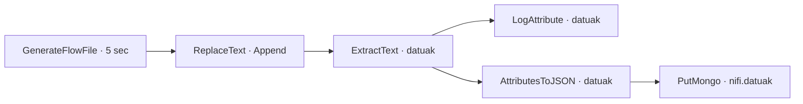

# 3. kasua · Atributuak, linajea eta MongoDB (DF1.3)

DF1.3 enuntziatuaren iturri kanonikoak `materialak/01_01_ApacheNifi.pdf` (DF1.3 atala) eta MongoDB konfiguraziorako `materialak/01_02_ApacheNifi_aurreratua.pdf` dira. Bi aldaerak gordetzen dira:

- [Oinarrizko linaje-fluxua](flow_03_atributuak_linajea.json)
- [DF1.3 MongoDB aldaera kanonikoa](flow_03_atributuak_linajea_aldaera2_mongodb.json)

## DF1.3 topologia eta konfigurazioa

`GenerateFlowFile`-ek FlowFile bana sortzen du 5 segundoan behin. `ReplaceText`-ek `Append` estrategiarekin `[[[ Data: ${now()} ]]]` eransten dio edukia ordezkatu gabe. `ExtractText`-ek eduki osoa `datuak` atributura ateratzen du (`(.*)`); `matched` harremana `LogAttribute`-era eta `AttributesToJSON`-era doa. Azken horrek `datuak` soilik bihurtzen du JSON edukira, eta `PutMongo`-k `nifi.datuak` bilduman txertatzen du.

MongoDB zerbitzu-erreferentzia eta datu-base/bilduma izenak JSON esportazioan ageri dira. Horrek ez du zerbitzua erabilgarri dagoela edo konexioa probatu denik esan nahi.

## Egiaztapen-egoera

Bi JSONak lokalean parsatu eta osagaien, harremanen eta erreferentzia-IDen egitura estatikoa egiaztatu da. **Ez da NiFi edo MongoDB zerbitzurik abiarazi, fluxua inportatu edo exekutatu, ezta log, provenance edo MongoDB emaitzarik egiaztatu ere.** Hortaz, fluxuaren exekuzio-emaitzak ez daude egiaztatuta; fitxategia definizio estatikoa da.

DF1.3 PDFak LogAttribute/nifi-app.log egiaztatzea eta MongoDB-n gordetzea eskatzen ditu; egiaztapen horiek ingurune baimendu batean egin behar dira.
