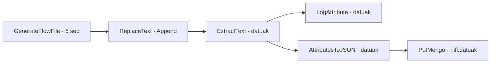

# 3. kasua · Atributuak, linajea eta MongoDB (DF1.3)

## Ejecución verificada y evidencia

2026-10-02: las dos variantes se ejecutaron una vez. La básica escribió
el contenido `proba`; la variante Mongo conservó el texto inicial y añadió
`[[[ Data: ... ]]]`, lo extrajo como `datuak`, lo registró con LogAttribute y
escribió un documento en `nifi.datuak`. Los eventos CONTENT_MODIFIED,
ATTRIBUTES_MODIFIED, CLONE y SEND permiten seguir esa transformación.
Se han verificado archivo, atributo del evento, log y documento Mongo.

[Resultado](evidencias/resultado_2026-10-02.json),
[contenido básico](evidencias/basic_proba.txt),
[documento Mongo](evidencias/mongo_datuak.json),
[log real](evidencias/nifi_app_extracto.log) y
[provenance Mongo](evidencias/flow_03_atributuak_linajea_aldaera2_mongodb_provenance.json).


DF1.3 enuntziatuaren iturri kanonikoak `materialak/01_01_ApacheNifi.pdf` (DF1.3 atala) eta MongoDB konfiguraziorako `materialak/01_02_ApacheNifi_aurreratua.pdf` dira. Bi aldaerak gordetzen dira:

- [Oinarrizko linaje-fluxua](flow_03_atributuak_linajea.json)
- [DF1.3 MongoDB aldaera kanonikoa](flow_03_atributuak_linajea_aldaera2_mongodb.json)

## DF1.3 topologia eta konfigurazioa


```mermaid
flowchart LR
    G[GenerateFlowFile · 5 sec] --> R[ReplaceText · Append]
    R --> E[ExtractText · datuak]
    E --> L[LogAttribute · datuak]
    E --> A[AttributesToJSON · datuak]
    A --> M[PutMongo · nifi.datuak]
```

`GenerateFlowFile`-ek FlowFile bana sortzen du 5 segundoan behin. `ReplaceText`-ek `Append` estrategiarekin `[[[ Data: ${now()} ]]]` eransten dio edukia ordezkatu gabe. `ExtractText`-ek eduki osoa `datuak` atributura ateratzen du (`(.*)`); `matched` harremana `LogAttribute`-era eta `AttributesToJSON`-era doa. Azken horrek `datuak` soilik bihurtzen du JSON edukira, eta `PutMongo`-k `nifi.datuak` bilduman txertatzen du.

MongoDB zerbitzu-erreferentzia eta datu-base/bilduma izenak JSON esportazioan ageri dira. Horrek ez du zerbitzua erabilgarri dagoela edo konexioa probatu denik esan nahi.

## Cómo comprobar la práctica

En un laboratorio configurado, importa el flow parado, enlaza el Controller
Service de MongoDB y valida los processors. Arranca una muestra corta; por cada
FlowFile revisa en provenance el contenido después de ReplaceText y el atributo
`datuak` después de ExtractText. `AttributesToJSON` cambia el **contenido** a
JSON con ese campo. Busca un documento equivalente en `nifi.datuak`.

Un log muestra que el atributo llegó a LogAttribute; no demuestra que Mongo lo
haya guardado. Si falta el documento, revisa el estado del servicio, bulletins y
la relationship de fallo de PutMongo. Estas instrucciones explican cómo repetir la ejecución ahora acreditada.


## Laboratorio aislado y reproducción

Los comandos siguientes se ejecutan desde la raíz y prueban los casos 1-6 en
una única instancia dedicada. No usan `infra/`, bases de datos personales ni
el canvas de otra instancia. Requieren Docker, Python 3 y las imágenes
`iabd-nifi:2.0.0-local`, `mongo:7.0` y `mysql:8.4`. Si falta la imagen local:

```bash
docker build -t iabd-nifi:2.0.0-local \
  06_NiFi/soluzioak/06_MariaDB_MongoDB_Laborategia_DF2.2
```

```bash
python 06_NiFi/soluzioak/scripts/nifi_lab_stack.py up
python 06_NiFi/soluzioak/scripts/nifi_lab_verificar.py prepare
python 06_NiFi/soluzioak/scripts/nifi_lab_ejecutar.py
python 06_NiFi/soluzioak/scripts/nifi_lab_evidencias.py
python 06_NiFi/soluzioak/scripts/nifi_lab_comparar.py
python 06_NiFi/soluzioak/scripts/nifi_lab_resultados.py
python 06_NiFi/soluzioak/scripts/nifi_lab_validar_evidencias.py
python 06_NiFi/soluzioak/scripts/nifi_lab_stack.py down
```

[Preparador](../scripts/nifi_lab_stack.py): Compose sanitizado embebido,
proyecto `bigdata-nifi-lab-20261002`, red dedicada y endpoint
`https://localhost:18443` publicado solo en loopback. Genera credenciales
aleatorias en `/tmp/bigdata-nifi-lab-20261002/credentials.json` y `.env`, con
modo 600 dentro de un directorio 700; exporta el certificado de NiFi y verifica
TLS y el hostname `localhost`. Ningún secreto entra en Git. No muestra tokens.
MySQL/MongoDB no publican puertos. No se sobreescribe un laboratorio existente.

[Importador](../scripts/nifi_lab_verificar.py) crea un PG propio y remapea
servicios/rutas solo dentro del laboratorio. [Ejecutor](../scripts/nifi_lab_ejecutar.py)
ejecuta SQL y GenerateFlowFile mediante `RUN_ONCE`; GetFile sondea entradas
con `Keep Source File=false` y se detiene al cerrar la prueba. Espera como
máximo diez minutos para
la carga SQL completa (puede necesitar ajuste en otra máquina), evita duplicar la carga SQL si las
colecciones ya tienen documentos y detiene su PG al terminar. Es una prueba
local: modifica solo directorios temporales, grupos y bases de datos del lab.
[Exportador](../scripts/nifi_lab_evidencias.py) guarda estados y provenance
acotado a 100 eventos por procesador; las listas largas de linaje conservan
20 UUID y el conteo total. Liberar resultados de consulta no borra eventos.
[Comparador](../scripts/nifi_lab_comparar.py) coteja todas las filas SQL/Mongo.
[Verificador de resultados](../scripts/nifi_lab_resultados.py) compara y archiva
los archivos reales y los documentos de muestra, sin guardar las filas de clientes.

La receta reúne los pasos ejecutados en esta sesión; no se ha repetido un
segundo arranque completo desde cero con el script conjunto. `down` retira
solo los contenedores y volúmenes del proyecto dedicado y conserva los
archivos temporales del host. Si se comparte con el caso 7, detener primero
su sidecar MinIO y coordinar el cierre. La evidencia versionada permite
[validación sin Docker](../scripts/nifi_lab_validar_evidencias.py).

**Límites:** ejecución real de NiFi por REST, contenido, logs y provenance;
no hay captura GUI. T3 abrió el HTTPS del lab pero no pudo cargar su
certificado en el navegador. La validación REST sí usa certificado verificado.
No se han accedido APIs con claves reales ni AWS.
