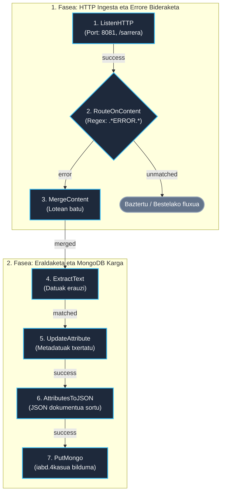

# NiFi 4. Kasua: HTTP bidezko Ingesta eta MongoDB (Caso 4)

> **Modulua / Gai-arloa:** Big Data Aplikatua · 01 DataFlow · Apache NiFi  
> **Fitxategi Nagusia:** [`flow_04_mongodb_http.json`](flow_04_mongodb_http.json)  
> **Iturria:** `GIDA Apache NiFi instalazioa eta kasu praktikoak 1-2-3-4.pdf` (42–45 orr.)

---

## 1. Helburua (Objetivo)

HTTP POST bidez denbora errealean testu/JSON mezuak jasotzea (`ListenHTTP`), mezuetan **erroreak** dauden detektatzea (`RouteOnContent`), errore-mezuak multzokatzea (`MergeContent`), metadatuak erauztea eta azkenik **MongoDB** datu-base dokumentalean gordetzea (`PutMongo`).

---

## 2. Arkitektura eta Diagrama (Mermaid)



---

## 3. Prozesadoreen Konfigurazio Gakoak

| Prozesadorea | Posizioa | Propietate Gakoak | Balioa / Azalpena |
| :--- | :--- | :--- | :--- |
| **`ListenHTTP`** | `(100, 150)` | `Base Path`<br/>`Listening Port` | `sarrera`<br/>`8081` (Kanpotik mezuak POST bidez jasotzeko) |
| **`RouteOnContent`** | `(500, 150)` | `Match Requirement`<br/>Propietate dinamikoa: `error` | `content must match spec`<br/>`.*ERROR.*` (edukian ERROR hitza bilatu) |
| **`MergeContent`** | `(900, 150)` | `Merge Strategy`<br/>`Minimum Number of Entries`<br/>`Max Bin Age` | `Bin-Packing Algorithm`<br/>`5` (edo 10 mezu)<br/>`30 sec` (lotea ixteko gehienezko denbora) |
| **`ExtractText`** | `(900, 400)` | Propietate dinamikoa: `edukia` | `(.*)` (mezuaren gorputza atributura pasatu) |
| **`UpdateAttribute`** | `(1300, 400)`| Propietate dinamikoak | `ingesta_data` = `${now():format('yyyy-MM-dd HH:mm:ss')}`<br/>`larritasuna` = `'KRITIKOA'` |
| **`AttributesToJSON`**| `(1700, 400)`| `Attributes List`<br/>`Destination` | `edukia,ingesta_data,larritasuna,filename`<br/>`flowfile-content` |
| **`PutMongo`** | `(2100, 400)`| `Mongo Database Name`<br/>`Mongo Collection Name`<br/>`Mode` | `iabd`<br/>`4kasua`<br/>`insert` |

---

## 4. Probak eta Egiaztapena (`curl`)

### 1. Errore mezua bidali (Webhook POST):
```bash
curl -X POST -H "Content-Type: text/plain" \
     -d "2026-09-21 11:30:00 [ERROR] Database connection failed on server node 03" \
     http://localhost:8081/sarrera
```

### 2. Mezu arrunta bidali (Iragazkiak baztertuko duena):
```bash
curl -X POST -H "Content-Type: text/plain" \
     -d "2026-09-21 11:30:05 [INFO] User login successful for admin" \
     http://localhost:8081/sarrera
```

### 3. MongoDB-n emaitza egiaztatu:
```bash
docker exec -it iabd-mongodb-nifi mongosh iabd --eval 'db["4kasua"].find().pretty()'
```
