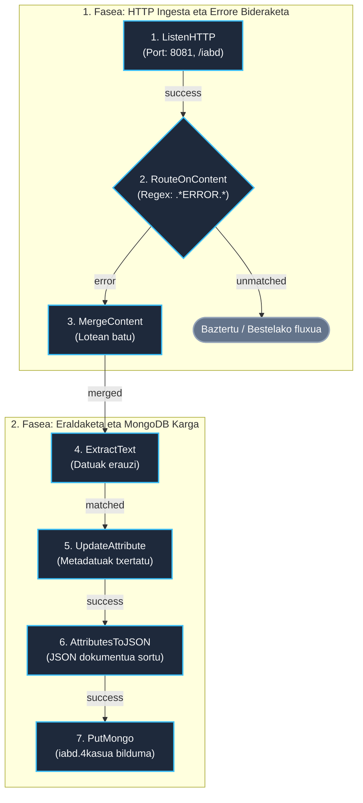

# NiFi 4. Kasua: HTTP bidezko Ingesta eta MongoDB (Caso 4)

> **Modulua / Gai-arloa:** Big Data Aplikatua · 01 DataFlow · Apache NiFi  
> **Fitxategi Nagusia:** [`flow_04_mongodb_http.json`](flow_04_mongodb_http.json)  
> **Iturria:** `GIDA Apache NiFi instalazioa eta kasu praktikoak 1-2-3-4.pdf` (42–45 orr.)

---

## 1. Helburua (Objetivo)

HTTP POST bidez denbora errealean testu/JSON mezuak jasotzea (`ListenHTTP`), mezuetan **erroreak** dauden detektatzea (`RouteOnContent`), errore-mezuak multzokatzea (`MergeContent`), metadatuak erauztea eta azkenik **MongoDB** datu-base dokumentalean gordetzea (`PutMongo`).

---

## 2. Arkitektura eta Diagrama (Mermaid)



---

## 3. Prozesadoreen Konfigurazio Gakoak

| Prozesadorea | Posizioa | Propietate Gakoak | Balioa / Azalpena |
| :--- | :--- | :--- | :--- |
| **`ListenHTTP`** | `(100, 150)` | `Base Path`<br/>`Listening Port` | `iabd`<br/>`8081` |
| **`RouteOnContent`** | `(500, 150)` | `Match Requirement`<br/>Propietate dinamikoa: `error` | `content must contain match`<br/>`.*ERROR.*` |
| **`MergeContent`** | `(900, 150)` | `Merge Strategy`<br/>`Minimum Number of Entries`<br/>`Max Bin Age`<br/>`Demarcator` | `Bin-Packing Algorithm`<br/>`5`<br/>`30 sec`<br/>benetako lerro-jauzia (LF) |
| **`ExtractText`** | `(900, 400)` | Propietate dinamikoa: `mezua` | `(.*)` DOTALL aktibatuta; gehienez 65 536 karaktere |
| **`UpdateAttribute`** | `(1300, 400)`| Propietate dinamikoak | `fecha` = `${now():format("yyyy-MM-dd HH:mm:ss")}`<br/>`mota` = `errorea` |
| **`AttributesToJSON`**| `(1700, 400)`| `Attributes List`<br/>`Destination` | `mezua,mota,fecha`<br/>`flowfile-content` |
| **`PutMongo`** | `(2100, 400)`| `Mongo Database Name`<br/>`Mongo Collection Name`<br/>`Mode` | `iabd`<br/>`4kasua`<br/>`insert` |

---

## 4. Probak eta Egiaztapena (`curl`)

NiFi-ren Compose konfigurazioak **ez du 8081 hostean argitaratzen**. Fluxua NiFi-n
inportatu, Controller Service-a konfiguratu eta abiarazi ondoren, proba
edukiontziaren barrutik egin daiteke. Inportatutako JSONa bakarrik ez da
exekuzioaren froga.

### 1. Errore mezua bidali:
```bash
docker exec iabd-nifi curl -sS -X POST -H "Content-Type: text/plain" \
     -d "ERROR: Database connection failed" http://localhost:8081/iabd
```

### 2. Mezu arrunta bidali (Iragazkiak baztertuko duena):
```bash
docker exec iabd-nifi curl -sS -X POST -H "Content-Type: text/plain" \
     -d "INFO: User login successful" http://localhost:8081/iabd
```

### 3. MongoDB-n emaitza egiaztatu:
```bash
docker exec -it iabd-mongodb-nifi mongosh iabd --eval 'db["4kasua"].find().pretty()'
```

`MergeContent`-ek 5 mezu edo gehienez 30 segundo itxaroten ditu. MongoDB-n
sortutako dokumentu bakoitzeko `mezua` eremuan lote bateko errore-mezuak egon
daitezke; ez da mezu bakoitzeko dokumentu bat. Egiaztapen hau **ez dago
exekutatuta** dokumentazio honetan.
