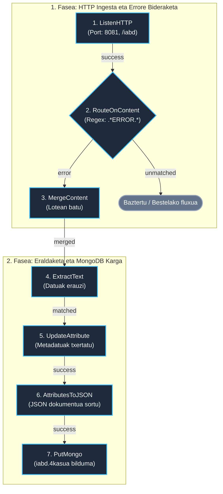

# NiFi 4. Kasua: HTTP bidezko Ingesta eta MongoDB (Caso 4)

## Ejecución verificada y evidencia

2026-10-02: ListenHTTP aceptó seis POST con código 200: uno INFO y cinco
ERROR. RouteOnContent excluyó INFO; MergeContent creó un JOIN de cinco
padres. MongoDB recibió un documento con los cinco errores separados por LF,
`mota=errorea` y `fecha` con formato `yyyy-MM-dd HH:mm:ss`. Se comparó la lista
de mensajes, sin exigir orden de llegada en el lote.

[Resultado](evidencias/resultado_2026-10-02.json),
[documento Mongo](evidencias/mongo_http.json) y
[provenance](evidencias/flow_04_mongodb_http_provenance.json).
Las solicitudes se enviaron desde el contenedor NiFi al puerto interno 8081;
no se publicó ese endpoint HTTP en el host.


> **Modulua / Gai-arloa:** Big Data Aplikatua · 01 DataFlow · Apache NiFi  
> **Fitxategi Nagusia:** [`flow_04_mongodb_http.json`](flow_04_mongodb_http.json)  
> **Iturria:** `GIDA Apache NiFi instalazioa eta kasu praktikoak 1-2-3-4.pdf` (42–45 orr.)

---

## 1. Helburua (Objetivo)

HTTP POST bidez denbora errealean testu/JSON mezuak jasotzea (`ListenHTTP`), mezuetan **erroreak** dauden detektatzea (`RouteOnContent`), errore-mezuak multzokatzea (`MergeContent`), metadatuak erauztea eta azkenik **MongoDB** datu-base dokumentalean gordetzea (`PutMongo`).

---

## 2. Arkitektura eta Diagrama (Mermaid)


```mermaid
flowchart TD
    subgraph Sarrera["1. Fasea: HTTP Ingesta eta Errore Bideraketa"]
        A["1. ListenHTTP<br/>(Port: 8081, /iabd)"] -->|success| B{"2. RouteOnContent<br/>(Regex: .*ERROR.*)"}
        B -->|error| C["3. MergeContent<br/>(Lotean batu)"]
        B -->|unmatched| D(["Baztertu / Bestelako fluxua"])
    end

    subgraph Karga["2. Fasea: Eraldaketa eta MongoDB Karga"]
        C -->|merged| E["4. ExtractText<br/>(Datuak erauzi)"]
        E -->|matched| F["5. UpdateAttribute<br/>(Metadatuak txertatu)"]
        F -->|success| G["6. AttributesToJSON<br/>(JSON dokumentua sortu)"]
        G -->|success| H["7. PutMongo<br/>(iabd.4kasua bilduma)"]
    end

    classDef proc fill:#1e293b,stroke:#38bdf8,stroke-width:2px,color:#f8fafc;
    classDef term fill:#64748b,stroke:#94a3b8,stroke-width:2px,color:#ffffff;
    class A,B,C,E,F,G,H proc;
    class D term;
```

---

## 3. Prozesadoreen Konfigurazio Gakoak

| Prozesadorea | Posizioa | Propietate Gakoak | Balioa / Azalpena |
| :--- | :--- | :--- | :--- |
| **`ListenHTTP`** | `(100, 150)` | `Base Path`<br/>`Listening Port` | `iabd`<br/>`8081` |
| **`RouteOnContent`** | `(500, 150)` | `Match Requirement`<br/>Propietate dinamikoa: `error` | `content must contain match`<br/>`.*ERROR.*` |
| **`MergeContent`** | `(900, 150)` | `Merge Strategy`<br/>`Minimum Number of Entries`<br/>`Max Bin Age`<br/>`Demarcator` | `Bin-Packing Algorithm`<br/>`5`<br/>`30 sec`<br/>benetako lerro-jauzia (LF) |
| **`ExtractText`** | `(900, 400)` | Propietate dinamikoa: `mezua` | `(.*)` DOTALL aktibatuta; gehienez 65 536 karaktere |
| **`UpdateAttribute`** | `(1300, 400)`| Propietate dinamikoak | `fecha` = `${now():format("yyyy-MM-dd HH:mm:ss")}`<br/>`mota` = `errorea` |
| **`AttributesToJSON`**| `(1700, 400)`| `Attributes List`<br/>`Destination` | `mezua,mota,fecha`<br/>`flowfile-content` |
| **`PutMongo`** | `(2100, 400)`| `Mongo Database Name`<br/>`Mongo Collection Name`<br/>`Mode` | `iabd`<br/>`4kasua`<br/>`insert` |

---

## 4. Probak eta Egiaztapena (`curl`)

NiFi-ren Compose konfigurazioak **ez du 8081 hostean argitaratzen**. Fluxua NiFi-n
inportatu, Controller Service-a konfiguratu eta abiarazi ondoren, proba
edukiontziaren barrutik egin daiteke. Inportatutako JSONa bakarrik ez da
exekuzioaren froga.

### 1. Errore mezua bidali:
```bash
docker exec iabd-nifi curl -sS -X POST -H "Content-Type: text/plain" \
     -d "ERROR: Database connection failed" http://localhost:8081/iabd
```

### 2. Mezu arrunta bidali (Iragazkiak baztertuko duena):
```bash
docker exec iabd-nifi curl -sS -X POST -H "Content-Type: text/plain" \
     -d "INFO: User login successful" http://localhost:8081/iabd
```

### 3. MongoDB-n emaitza egiaztatu:
```bash
docker exec -it iabd-mongodb-nifi mongosh iabd --eval 'db["4kasua"].find().pretty()'
```

`MergeContent`-ek 5 mezu edo gehienez 30 segundo itxaroten ditu. MongoDB-n
sortutako dokumentu bakoitzeko `mezua` eremuan lote bateko errore-mezuak egon
daitezke; ez da mezu bakoitzeko dokumentu bat. Egiaztapen hau **ez dago
exekutatuta** dokumentazio honetan.


## Laboratorio aislado y reproducción

Los comandos siguientes se ejecutan desde la raíz y prueban los casos 1-6 en
una única instancia dedicada. No usan `infra/`, bases de datos personales ni
el canvas de otra instancia. Requieren Docker, Python 3 y las imágenes
`iabd-nifi:2.0.0-local`, `mongo:7.0` y `mysql:8.4`. Si falta la imagen local:

```bash
docker build -t iabd-nifi:2.0.0-local \
  06_NiFi/soluzioak/06_MariaDB_MongoDB_Laborategia_DF2.2
```

```bash
python 06_NiFi/soluzioak/scripts/nifi_lab_stack.py up
python 06_NiFi/soluzioak/scripts/nifi_lab_verificar.py prepare
python 06_NiFi/soluzioak/scripts/nifi_lab_ejecutar.py
python 06_NiFi/soluzioak/scripts/nifi_lab_evidencias.py
python 06_NiFi/soluzioak/scripts/nifi_lab_comparar.py
python 06_NiFi/soluzioak/scripts/nifi_lab_resultados.py
python 06_NiFi/soluzioak/scripts/nifi_lab_validar_evidencias.py
python 06_NiFi/soluzioak/scripts/nifi_lab_stack.py down
```

[Preparador](../scripts/nifi_lab_stack.py): Compose sanitizado embebido,
proyecto `bigdata-nifi-lab-20261002`, red dedicada y endpoint
`https://localhost:18443` publicado solo en loopback. Genera credenciales
aleatorias en `/tmp/bigdata-nifi-lab-20261002/credentials.json` y `.env`, con
modo 600 dentro de un directorio 700; exporta el certificado de NiFi y verifica
TLS y el hostname `localhost`. Ningún secreto entra en Git. No muestra tokens.
MySQL/MongoDB no publican puertos. No se sobreescribe un laboratorio existente.

[Importador](../scripts/nifi_lab_verificar.py) crea un PG propio y remapea
servicios/rutas solo dentro del laboratorio. [Ejecutor](../scripts/nifi_lab_ejecutar.py)
ejecuta SQL y GenerateFlowFile mediante `RUN_ONCE`; GetFile sondea entradas
con `Keep Source File=false` y se detiene al cerrar la prueba. Espera como
máximo diez minutos para
la carga SQL completa (puede necesitar ajuste en otra máquina), evita duplicar la carga SQL si las
colecciones ya tienen documentos y detiene su PG al terminar. Es una prueba
local: modifica solo directorios temporales, grupos y bases de datos del lab.
[Exportador](../scripts/nifi_lab_evidencias.py) guarda estados y provenance
acotado a 100 eventos por procesador; las listas largas de linaje conservan
20 UUID y el conteo total. Liberar resultados de consulta no borra eventos.
[Comparador](../scripts/nifi_lab_comparar.py) coteja todas las filas SQL/Mongo.
[Verificador de resultados](../scripts/nifi_lab_resultados.py) compara y archiva
los archivos reales y los documentos de muestra, sin guardar las filas de clientes.

La receta reúne los pasos ejecutados en esta sesión; no se ha repetido un
segundo arranque completo desde cero con el script conjunto. `down` retira
solo los contenedores y volúmenes del proyecto dedicado y conserva los
archivos temporales del host. Si se comparte con el caso 7, detener primero
su sidecar MinIO y coordinar el cierre. La evidencia versionada permite
[validación sin Docker](../scripts/nifi_lab_validar_evidencias.py).

**Límites:** ejecución real de NiFi por REST, contenido, logs y provenance;
no hay captura GUI. T3 abrió el HTTPS del lab pero no pudo cargar su
certificado en el navegador. La validación REST sí usa certificado verificado.
No se han accedido APIs con claves reales ni AWS.
