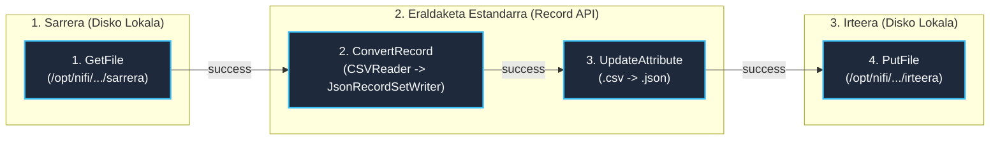

# NiFi 5. Kasua / DF2.1 Ariketa: CSV JSON Bihurtu Prozesu-Taldean (ConvertRecord)

> **Modulua / Gai-arloa:** Big Data Aplikatua · 01 DataFlow · Apache NiFi Aurreratua  
> **Ariketa Ofiziala:** **DF2.1**  
> **Fitxategi Nagusia:** [`flow_05_csv_json_df2.1.json`](file:///home/tears/bigdata/soluzioak/03_DataFlow_Apache_NiFi/05_CSV_JSON_ConvertRecord_DF2.1/flow_05_csv_json_df2.1.json)  
> **Lagin Datuak:** [`sarrera/datuak.csv`](file:///home/tears/bigdata/soluzioak/03_DataFlow_Apache_NiFi/05_CSV_JSON_ConvertRecord_DF2.1/sarrera/datuak.csv)  
> **Iturria:** `01_02_ApacheNifi_aurreratua.pdf` (17–26 eta 60 orr.)

---

## 1. Eskakizunak eta Helburua (DF2.1)

1. **Prozesu-talde modularra (Process Group):** Fluxu osoa kapsulatu eta berrerabilgarri egitea (`5kasua_iabd`).
2. **Autonomia Osoa (`GetFile` $\rightarrow$ `PutFile`):** Taldeak bere kabuz funtzionatzen du tokiko fitxategi-sisteman (`/sarrera` $\rightarrow$ `ConvertRecord` $\rightarrow$ `UpdateAttribute` $\rightarrow$ `/irteera`).
3. **Erregistroen Bihurketa Optimizatua (`ConvertRecord`):** Fitxategia zatitu gabe (*split-free*), CSV egitura zuzenean JSON formatura bihurtzea memoria-eraginkortasun handienarekin.
4. **Luzapena Eguneratu (`UpdateAttribute`):** Irteerako fitxategiari `.csv` luzapena kendu eta `.json` ipintzea.

> [!NOTE]
> **NiFi 2.0 eta Ataken Balidazioa (Ports Validation):**  
> NiFi 2.0-n, `Input Port` eta `Output Port` batek derrigorrezkoa dute kanpoko konexio aktibo bat talde nagusitik (`Port has no incoming/outgoing connections`). Fluxua bere kabuz diskotik elikatzen denez (`GetFile`), atakak kendu dira Process Group-ak balidazio-abisurik (`⚠️`) ez erakusteko eta %100 garbi gelditzeko.

---

## 2. Arkitektura eta Diagrama (Mermaid)



---

## 3. Kontroladore Zerbitzuak (Txertatuak)

Fluxu-fitxategiak bi Controller Service-ak prozesu-taldearen barruan txertatuta dauzka:

1. **`CSVReader` (`org.apache.nifi.csv.CSVReader`):**
   - `Schema Access Strategy`: `Use String Fields From Header`
   - `Value Separator`: `;`
   - `Treat First Line as Header`: `true`
2. **`JsonRecordSetWriter` (`org.apache.nifi.json.JsonRecordSetWriter`):**
   - `Schema Access Strategy`: `Inherit Record Schema`
   - `Output Grouping`: `Array` (edo lerroka)
   - `Pretty Print JSON`: `true` (garbi irakurtzeko)

---

## 4. Datuak eta Egiaztapen Proba

### Sarrerako datuak (`sarrera/datuak.csv`):
```csv
id;izena;adina;hiria;soldata
1;Ane;28;Donostia;32000.50
2;Mikel;34;Bilbo;41000.00
3;Jon;22;Gasteiz;24500.75
4;Leire;41;Iruña;53000.20
5;Aitor;30;Eibar;36000.00
```

### Irteerako JSON fitxategia (`irteera/datuak.json`):
```json
[
  {
    "id": "1",
    "izena": "Ane",
    "adina": "28",
    "hiria": "Donostia",
    "soldata": "32000.50"
  },
  {
    "id": "2",
    "izena": "Mikel",
    "adina": "34",
    "hiria": "Bilbo",
    "soldata": "41000.00"
  },
  ...
]
```
