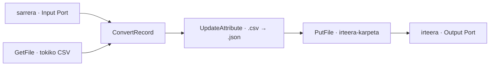

# DF2.1 · CSV → JSON ConvertRecord prozesu-taldean

Iturri kanonikoa [01_02 Apache NiFi Aurreratua](../../materialak/01_02_ApacheNifi_aurreratua.pdf), DF2.1 atala da. Eskaerak lau prozesadore, `sarrera`/`irteera` muga-portuak, `CSVReader` eta `JsonRecordSetWriter` Controller Service-ak, eta JSON irteeraren egiaztapena zehazten ditu.

- [DF2.1 flow definizio estatikoa](flow_05_csv_json_df2.1.json)
- [CSV lagina](sarrera/datuak.csv)

## Topologia

Prozesu-taldeak `5kasua_iabd` izena mantentzen du. Tokiko bide nagusia `GetFile → ConvertRecord → UpdateAttribute → PutFile` da; Input Port-ak CSV FlowFile-a zuzenean `ConvertRecord`-era bidaltzeko sarrera alternatiboa eskaintzen du. NiFi-ren `GetFile` iturri-prozesadoreak ez du sarrerako FlowFile-harremanik, beraz Input Port-a GetFile-ren aurretik kateatzea ez litzateke baliozko konexioa. Bi sarrerek bihurketa eta ondorengo izen-aldaketa partekatzen dituzte. `PutFile`-ren `success` FlowFile-a `irteera` Output Port-era ere bideratzen da.

`ConvertRecord`-ek txertatutako `CSVReader` (`;` bereizlea) eta `JsonRecordSetWriter` (JSON array) erabiltzen ditu. `UpdateAttribute`-ek `filename` atributuko `.csv` luzapena `.json`-era aldatzen du; `PutFile`-ek JSON edukia tokiko irteera-direktorioan idazteko konfiguratuta dago. Direktorio absolutuak laborategiko NiFi edukiontzi-bideak dira, ez ordenagailu honetako bide-egiaztapenak.

## Egiaztapen-egoera

JSONa lokalean parsatu da eta lau prozesadoreak, bi Controller Service-en ID erreferentziak, bi muga-portuen izenak eta konexio-muturrak estatistikoki balioztatu dira. **Ez da NiFi abiarazi, flow-a inportatu edo exekutatu, CSVtik JSON fitxategirik sortu, ezta irteera-fitxategi zerrendarik egiaztatu ere.** JSON definizio estatikoa da; PDFko exekuzio-proba eta irteera-ebidentzia ez dira faltsuki baieztatzen.
