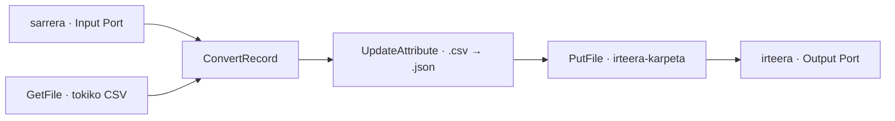

# DF2.1 · CSV → JSON ConvertRecord prozesu-taldean

## Ejecución verificada y evidencia

2026-10-02: NiFi convirtió las cinco filas del CSV en un array JSON con
los mismos campos y valores. Se ejecutó la entrada GetFile y después la
entrada alternativa por `sarrera` Input Port, con GetFile y PutFile de prueba
en el PG padre. Se confirmó tráfico real por ambos puertos y el contenido de
salida en el padre. La segunda entrada fue una prueba separada del mismo dato.
Las métricas de los puertos son una ventana temporal de cinco minutos.
Se guardó el snapshot inmediatamente tras la última transferencia real de
prueba para evitar que envejeciera durante la carga SQL; no es un contador
histórico de todos los registros.

[Resultado](evidencias/resultado_2026-10-02.json),
[JSON real](evidencias/datuak.json),
[estados de puertos](evidencias/boundary_ports_status.json) y
[provenance](evidencias/flow_05_csv_json_df2.1_provenance.json).


Iturri kanonikoa [01_02 Apache NiFi Aurreratua](../../materialak/01_02_ApacheNifi_aurreratua.pdf), DF2.1 atala da. Eskaerak lau prozesadore, `sarrera`/`irteera` muga-portuak, `CSVReader` eta `JsonRecordSetWriter` Controller Service-ak, eta JSON irteeraren egiaztapena zehazten ditu.

- [DF2.1 flow definizio estatikoa](flow_05_csv_json_df2.1.json)
- [CSV lagina](sarrera/datuak.csv)

## Topologia


```mermaid
flowchart LR
  I[sarrera · Input Port] --> C[ConvertRecord]
  G[GetFile · tokiko CSV] --> C
  C --> U[UpdateAttribute · .csv → .json]
  U --> P[PutFile · irteera-karpeta]
  P --> O[irteera · Output Port]
```

Prozesu-taldeak `5kasua_iabd` izena mantentzen du. Tokiko bide nagusia `GetFile → ConvertRecord → UpdateAttribute → PutFile` da; Input Port-ak CSV FlowFile-a zuzenean `ConvertRecord`-era bidaltzeko sarrera alternatiboa eskaintzen du. NiFi-ren `GetFile` iturri-prozesadoreak ez du sarrerako FlowFile-harremanik, beraz Input Port-a GetFile-ren aurretik kateatzea ez litzateke baliozko konexioa. Bi sarrerek bihurketa eta ondorengo izen-aldaketa partekatzen dituzte. `PutFile`-ren `success` FlowFile-a `irteera` Output Port-era ere bideratzen da.

`ConvertRecord`-ek txertatutako `CSVReader` (`;` bereizlea) eta `JsonRecordSetWriter` (JSON array) erabiltzen ditu. `UpdateAttribute`-ek `filename` atributuko `.csv` luzapena `.json`-era aldatzen du; `PutFile`-ek JSON edukia tokiko irteera-direktorioan idazteko konfiguratuta dago. Direktorio absolutuak laborategiko NiFi edukiontzi-bideak dira, ez ordenagailu honetako bide-egiaztapenak.

## Cómo verificar la conversión

1. Importa el flow parado en el laboratorio de [caso 6](../06_MariaDB_MongoDB_Laborategia_DF2.2/README.md)
   y comprueba los paths de GetFile/PutFile en el contenedor.
2. Habilita CSVReader y JsonRecordSetWriter y verifica el separador `;` y cabecera.
3. Introduce la muestra por **una** de las dos entradas, para no duplicar el dato.
4. Compara CSV y JSON: misma cantidad de registros y mismos campos/valores según
   el esquema del Reader. El escritor produce un array, no JSONL.
5. Comprueba el archivo y la salida del puerto: cambiar `.csv` por `.json` solo
   cambia un atributo; es ConvertRecord quien transforma el contenido.

Si ves `invalid`, revisa servicios y propiedades; si el contenido no se parsea,
comprueba delimitador y esquema. La ejecución documentada incluye esa comprobación runtime.


## Laboratorio aislado y reproducción

Los comandos siguientes se ejecutan desde la raíz y prueban los casos 1-6 en
una única instancia dedicada. No usan `infra/`, bases de datos personales ni
el canvas de otra instancia. Requieren Docker, Python 3 y las imágenes
`iabd-nifi:2.0.0-local`, `mongo:7.0` y `mysql:8.4`. Si falta la imagen local:

```bash
docker build -t iabd-nifi:2.0.0-local \
  06_NiFi/soluzioak/06_MariaDB_MongoDB_Laborategia_DF2.2
```

```bash
python 06_NiFi/soluzioak/scripts/nifi_lab_stack.py up
python 06_NiFi/soluzioak/scripts/nifi_lab_verificar.py prepare
python 06_NiFi/soluzioak/scripts/nifi_lab_ejecutar.py
python 06_NiFi/soluzioak/scripts/nifi_lab_evidencias.py
python 06_NiFi/soluzioak/scripts/nifi_lab_comparar.py
python 06_NiFi/soluzioak/scripts/nifi_lab_resultados.py
python 06_NiFi/soluzioak/scripts/nifi_lab_validar_evidencias.py
python 06_NiFi/soluzioak/scripts/nifi_lab_stack.py down
```

[Preparador](../scripts/nifi_lab_stack.py): Compose sanitizado embebido,
proyecto `bigdata-nifi-lab-20261002`, red dedicada y endpoint
`https://localhost:18443` publicado solo en loopback. Genera credenciales
aleatorias en `/tmp/bigdata-nifi-lab-20261002/credentials.json` y `.env`, con
modo 600 dentro de un directorio 700; exporta el certificado de NiFi y verifica
TLS y el hostname `localhost`. Ningún secreto entra en Git. No muestra tokens.
MySQL/MongoDB no publican puertos. No se sobreescribe un laboratorio existente.

[Importador](../scripts/nifi_lab_verificar.py) crea un PG propio y remapea
servicios/rutas solo dentro del laboratorio. [Ejecutor](../scripts/nifi_lab_ejecutar.py)
ejecuta SQL y GenerateFlowFile mediante `RUN_ONCE`; GetFile sondea entradas
con `Keep Source File=false` y se detiene al cerrar la prueba. Espera como
máximo diez minutos para
la carga SQL completa (puede necesitar ajuste en otra máquina), evita duplicar la carga SQL si las
colecciones ya tienen documentos y detiene su PG al terminar. Es una prueba
local: modifica solo directorios temporales, grupos y bases de datos del lab.
[Exportador](../scripts/nifi_lab_evidencias.py) guarda estados y provenance
acotado a 100 eventos por procesador; las listas largas de linaje conservan
20 UUID y el conteo total. Liberar resultados de consulta no borra eventos.
[Comparador](../scripts/nifi_lab_comparar.py) coteja todas las filas SQL/Mongo.
[Verificador de resultados](../scripts/nifi_lab_resultados.py) compara y archiva
los archivos reales y los documentos de muestra, sin guardar las filas de clientes.

La receta reúne los pasos ejecutados en esta sesión; no se ha repetido un
segundo arranque completo desde cero con el script conjunto. `down` retira
solo los contenedores y volúmenes del proyecto dedicado y conserva los
archivos temporales del host. Si se comparte con el caso 7, detener primero
su sidecar MinIO y coordinar el cierre. La evidencia versionada permite
[validación sin Docker](../scripts/nifi_lab_validar_evidencias.py).

**Límites:** ejecución real de NiFi por REST, contenido, logs y provenance;
no hay captura GUI. T3 abrió el HTTPS del lab pero no pudo cargar su
certificado en el navegador. La validación REST sí usa certificado verificado.
No se han accedido APIs con claves reales ni AWS.
