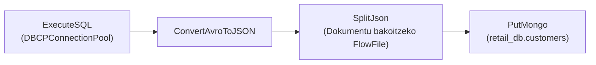

# Apache NiFi 6. Kasua: MariaDB (MySQL) -> NiFi -> MongoDB Pipeline-a

Modulua: **DataFlow eta Datu-base banatuak**  
Direktorioa: `06_MariaDB_MongoDB_Laborategia`

---

## 1. Azpiegitura eta Zerbitzuak (Docker Compose)

Laborategi honek hiru zerbitzu konektatzen ditu sare berdinean:
- **`iabd-mysql-nifi` (MySQL/MariaDB):** Datu-base erlazionala (`retail_db`). Portua: `3306`.
- **`iabd-mongodb-nifi` (MongoDB):** Datu-base dokumentala NoSQL. Portua: `27017`.
- **`iabd-nifi` (Apache NiFi):** ETL orkestratzailea. Web interfaze segurua: `https://localhost:8443/nifi` (Erabiltzailea: `nifi`, Pasahitza: `nifinifinifi`).

### Nola abiarazi:
```bash
cd ~/bigdata/soluzioak/03_DataFlow_Apache_NiFi/06_MariaDB_MongoDB_Laborategia
./redeploy.sh          # build + up + espera a healthy + estado
# o manual: docker compose up --build -d
```

Acceso: **https://nifi.bigdata.local/nifi** vía nginx (frontal HTTPS con
cert wildcard `*.bigdata.local` de CA local `certs/ca.crt`, válida hasta 2100).
Requiere una vez: `echo '127.0.0.1 nifi.bigdata.local' | sudo tee -a /etc/hosts`
y la CA confiada en el navegador (ya instalada en Zen + nssdb; reiniciar Zen).
Credenciales: `.env` (600, generado aleatorio, no versionado) y
`./pass-import.sh` las guarda en Proton Pass (tras `pass-cli login`).
MySQL/Mongo solo escuchan en 127.0.0.1; el 8443 directo de NiFi queda como reserva.

> **Oharra:** Irakasleak emandako jatorrizko `docker-compose.yml` fitxategian Windows bide finkoa zegoen (`C:/nifi/ariketak`). Linux ingurunerako moldatu dugu (`./ariketak:/opt/nifi/ariketak`).
> **2026-09-21:** NiFi ahora se construye con `Dockerfile.nifi` (`apache/nifi:2.0.0` + driver JDBC horneado en `/opt/mysql-connector-j-8.0.31.jar`, misma ruta que espera el DBCPConnectionPool).
> `create_db.sql` se monta en el servicio `mysql` (`/docker-entrypoint-initdb.d/01-retail_db.sql`, solo con volumen `mysql-data` vacío).
> Imágenes pineadas (`mysql:8.4`, `mongo:7.0`), credenciales por `.env`, red `iabd-nifi-lab-net`, volúmenes con nombre y healthchecks con `depends_on: healthy`.

---

## 2. NiFi Fluxuaren Diseinua (DataFlow)

Pipeline-aren helburua da MySQL-tik bezeroen eta salmenten datuak ateratzea, JSON dokumentu bihurtzea eta MongoDB-ko bilduma batean txertatzea.



### 1. DBCPConnectionPool (Controller Service):
- **Database Connection URL:** `jdbc:mysql://mysql:3306/retail_db?useSSL=false&allowPublicKeyRetrieval=true`
- **Database Driver Class Name:** `com.mysql.cj.jdbc.Driver`
- **Database Driver Location(s):** `/opt/mysql-connector-j-8.0.31.jar`
- **Database User:** `iabd`
- **Password:** `iabd`

### 2. `ExecuteSQL` Processor:
- **DBCP Connection Pool:** Guk sortutako `DBCPConnectionPool`
- **SQL select query:**
  ```sql
  SELECT c.customer_id, c.customer_fname, c.customer_lname, c.customer_city, c.customer_state
  FROM customers c;
  ```
- **Output:** Avro formatuko FlowFile bat jasotzen du.

### 3. `ConvertAvroToJSON` Processor:
- Avro bitarra JSON testu egituratu bihurtzen du.

### 4. `SplitJson` Processor:
- **JsonPath Expression:** `$.*` (Erregistro bakoitzeko JSON FlowFile autonomo bat sortzen du).

### 5. `PutMongo` Processor:
- **Mongo URI:** `mongodb://mongodb:27017`
- **Mongo Database Name:** `retail_db`
- **Mongo Collection Name:** `customers_collection`
- **Mode:** `insert`

---

## 3. Emaitzak Egiaztatzea (MongoDB CLI)

Datuak zuzen kargatu direla egiaztatzeko, exekutatu MongoDB kontainerrean:
```bash
docker exec -it iabd-mongodb-nifi mongosh retail_db --eval 'db.customers_collection.find().limit(5)'
```
