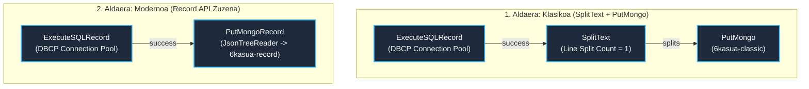

# NiFi 6. Kasua / DF2.2 Ariketa: MariaDB → MongoDB Pipeline-a (Bi Aldaerak)

> **Modulua / Gai-arloa:** Big Data Aplikatua · 01 DataFlow · Apache NiFi Aurreratua  
> **Ariketa Ofiziala:** **DF2.2**  
> **Fitxategi Nagusiak:**
> - [`flow_06_mariadb_mongodb_classic.json`](file:///home/tears/bigdata/soluzioak/03_DataFlow_Apache_NiFi/06_MariaDB_MongoDB_Laborategia_DF2.2/flow_06_mariadb_mongodb_classic.json) (1. Aldaera: Klasikoa)
> - [`flow_06_mariadb_mongodb_record.json`](file:///home/tears/bigdata/soluzioak/03_DataFlow_Apache_NiFi/06_MariaDB_MongoDB_Laborategia_DF2.2/flow_06_mariadb_mongodb_record.json) (2. Aldaera: Record API)
> - **Konparaketa Txostena:** [`DF2.2_konparaketa_oharra.md`](file:///home/tears/bigdata/soluzioak/03_DataFlow_Apache_NiFi/06_MariaDB_MongoDB_Laborategia_DF2.2/DF2.2_konparaketa_oharra.md)  
> - **Gida Teknikoa:** [`Ebazpena_Kasu_6.md`](file:///home/tears/bigdata/soluzioak/03_DataFlow_Apache_NiFi/06_MariaDB_MongoDB_Laborategia_DF2.2/Ebazpena_Kasu_6.md)  
> **Iturria:** `01_02_ApacheNifi_aurreratua.pdf` (27–40 eta 61 orr.)

---

## 1. Testuingurua eta Helburua

`retail_db` datu-base erlazionaleko bezeroen datuak (`customers` taula) MySQL/MariaDBtik **MongoDB** datu-base dokumentalera transferitzea bi arkitektura desberdin alderatuz:

1. **1. Aldaera (Klasikoa):** `ExecuteSQLRecord` $\rightarrow$ `SplitText` (Line Split Count=1) $\rightarrow$ `PutMongo` (Bilduma: `6kasua-classic`).
2. **2. Aldaera (Record API / Modernoa):** `ExecuteSQLRecord` $\rightarrow$ `PutMongoRecord` zuzenean (Bilduma: `6kasua-record`).

---

## 2. Arkitekturen Konparaketa-Diagrama (Mermaid)



---

## 3. Konparaketa Teknikoa eta Errendimendua (Laburpena)

*(Ikus txosten osoa [`DF2.2_konparaketa_oharra.md`](file:///home/tears/bigdata/soluzioak/03_DataFlow_Apache_NiFi/06_MariaDB_MongoDB_Laborategia_DF2.2/DF2.2_konparaketa_oharra.md) fitxategian)*

| Ezaugarria | 1. Aldaera: Klasikoa (`SplitText`) | 2. Aldaera: Record API (`PutMongoRecord`) |
| :--- | :--- | :--- |
| **Prozesadore kopurua** | 3 | **2 (sinpleagoa)** |
| **Sortutako FlowFile-ak** | $N$ FlowFile (erregistro bakoitzeko bat) | **FlowFile bakarra** (korronte osoa) |
| **I/O Repository Presioa** | Izugarria (FlowFile biltegia asetzen da) | **Minimoa** (metadata bakar bat) |
| **JVM Memoria / GC** | GC etenaldi maizak milaka objekturekin | Egonkorra eta arina |
| **Txertaketa mota MongoDB-n**| Banakako `insert` eskaerak | **Batch / Bulk insert masiboa** |
| **Proba enpirikoaren abiadura** | ~2.500 dok / min | **>160.000 dok / min (~64x azkarrago)** |

---

## 4. Azpiegitura (Docker Compose) eta Abioa

Laborategia abiarazteko:
```bash
cd /home/tears/bigdata/soluzioak/03_DataFlow_Apache_NiFi/06_MariaDB_MongoDB_Laborategia_DF2.2
./redeploy.sh
# Edo: docker compose up -d
```

- **NiFi Web UI:** `https://nifi.bigdata.local/nifi` (edo `https://localhost:8443/nifi`)
- **MySQL / MariaDB:** `localhost:3306` (Erabiltzailea: `iabd`, Pasahitza: `iabd`, DB: `retail_db`)
- **MongoDB:** `localhost:27017` (DB: `iabd`)

---

## 5. Egiaztapena MongoDB-n (CLI)

Bi aldaeren kargak egiaztatzeko:
```bash
# 1. Aldaera (Klasikoa)
docker exec -it iabd-mongodb-nifi mongosh iabd --eval 'db["6kasua-classic"].countDocuments()'

# 2. Aldaera (Record API)
docker exec -it iabd-mongodb-nifi mongosh iabd --eval 'db["6kasua-record"].countDocuments()'
```

## 6. Nota operativa: flujos efímeros (2026-09-22)

El `flow.json.gz` de NiFi vive en el contenedor, **no** en un volumen: al recrear
el contenedor (`up -d` tras cambiar el compose, `--clean`, etc.) el canvas queda
vacío y hay que **reimportar** (los JSON del repo son la fuente de verdad):
```bash
set -a; source .env; set +a; export NIFI_PASS="$NIFI_PASSWORD"
python3 ../scripts/inportatu_fluxuak.py   # 7 grupos (01–07) en el canvas
```
No reimportar dos veces seguidas sin limpiar: cada importación crea grupos nuevos
(IDs distintos). El frontal nginx y Kafka viven en `infra/` (arrancar primero).
