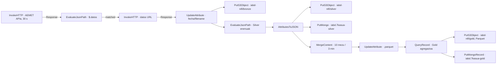

# DF2.3 · AEMET Data Lake Medallion

Flow export estatikoa: [`flow_07_aemet_datalake_medallion.json`](flow_07_aemet_datalake_medallion.json). Iturri didaktikoa: [`01_02_ApacheNifi_aurreratua.pdf`](../../materialak/01_02_ApacheNifi_aurreratua.pdf), DF2.3 atala (41–53, 62. or.). NiFi irudia [Dockerfile.nifi](../06_MariaDB_MongoDB_Laborategia_DF2.2/Dockerfile.nifi)-n finkatuta dago: `apache/nifi:2.0.0`.

## Fluxuaren diseinua

Lehen HTTP deiak AEMET OpenData-ren udalerri **bakarreko** predikzio-endpoint dokumentatua erabiltzen du (`/horaria/{municipio}`) eta erantzuneko `datos` URL-a ateratzen du; bigarren deiak URL horretako edukia deskargatzeko diseinatuta dago. Jatorrizko `/horaria/todos` eskaerak udalerri guztiak 30 segundoz behin ekartzeko arriskua zuen; orain `#{AEMET_MUNICIPIO}` parametro ez-sentikorra NiFi-ko Parameter Context-ean bete behar da, `AEMET_API_KEY` gako sentikorrarekin batera. [AEMETen OpenAPI espezifikazio ofizialak](https://opendata.aemet.es/AEMET_OpenData_specification.json) bi endpointak bereizten ditu. Bi urratsak flow-ean modelatuta daude; **ez da datu-API eskaerarik egin**.

Bronze-k erantzun gordina `s3://iabd-nifi/bronze/{filename}`-en idazten du. Silver-ek iturburu-PDFko `$.municipio.NOMBRE`, `$.temperatura_actual` eta `$.humedad` JSONPath adibideak mantentzen ditu, eta JSONa S3ra eta `iabd.7kasua-silver` Mongo bildumara bidaltzen du. Hala ere, PDFko bide horiek aurreko `api.el-tiempo.net` hornitzailearen erantzunari dagozkio; AEMET OpenData-k `datos`/`metadatos` erreferentziak itzultzen ditu lehen urratsean. Beraz, Silver-eko JSONPath-ak **AEMETen benetako payload-aren aurka mapatu eta egiaztatu behar dira fluxua aktibatu aurretik**. Ez da hemen erantzun edo datu errealik asmatu.

Gold-ek 10 Silver erregistro edo 3 minutu arte elkartzen ditu, NDJSON erregistroen artean lerro-jauzia jarriz, hirika agregatzen du `QueryRecord` bidez eta Parquet emaitza paraleloan bidaltzen du S3ra eta `iabd.7kasua-gold` bildumara. `PutMongoRecord`-ek Gold-en Parquet edukia `ParquetReader` bidez irakurtzeko erreferentzia du.

## Operadoreak eman beharreko runtime konfigurazioa

Flow-ak ez du kontu, gako, bucket-secret edo endpoint pribaturik gordetzen. Inportatu aurretik edo ondoren, konfiguratu eta izen berdineko zerbitzuekin lotu:

- **AWS credentials provider**: `AWSCredentialsProviderControllerService` runtime-ko kredentzial-iturrira lotu eta `Use Default Credentials=true` ezarri (adibidez, NiFi exekutatzen duen inguruneko rol/credential chain); bestela, operadoreak kanpoko credentials file edo credential source bat eman behar du. S3 bucket izena ariketak eskatutako `iabd-nifi` da; `AWS_REGION` Parameter Context bidez eman behar da.
- **AEMET API key**: `AEMET_API_KEY` izeneko parametro sentikorra sortu NiFi Parameter Context batean; lehen `InvokeHTTP`-ko `api_key` header-ak `#{AEMET_API_KEY}` erreferentzia dauka. Ez ezarri baliorik JSONean.
- **Udalerria**: `AEMET_MUNICIPIO` izeneko parametro ez-sentikorra sortu, AEMETek eskatzen duen udalerri-kode baliodunarekin; ez erabili `todos` baliotik. Fluxuaren eremu-mapaketa benetako `datos` payload batean berrikusi arte ez aktibatu Silver/Gold.
- **MongoDBControllerService**: operadoreak bere konexioa eman behar du; bildumak `iabd.7kasua-silver` eta `iabd.7kasua-gold` dira.
- **Record zerbitzuak**: `JsonTreeReader` NDJSON Silver-erako, `ParquetRecordSetWriter` QueryRecord-eko Gold irteerarako eta `ParquetReader` MongoDB Gold sink-erako.

> Runtime-ko service/parameter erreferentziak JSONeko `externalControllerServices` eta `parameterContexts` atalean daude. Zerbitzu horiek ez daude esportazio honetan sortuta, eta NiFi-n balioztatu gabe daude. Osagaiak desgaituta daude ustekabeko exekuziorik ez gertatzeko; payload-eremuen mapaketa eta ingurune honetako zerbitzu izenak egiaztatu ondoren soilik aktibatu.

## Egiaztapen estatikoa eta mugak

NiFi 2.0.0-rako osagaien/property izenak [Apache NiFi `rel/nifi-2.0.0` iturburuan](https://github.com/apache/nifi/tree/rel/nifi-2.0.0/nifi-extension-bundles) eta `Dockerfile.nifi`-ko oinarrizko irudiarekin alderatu dira: [PutS3Object](https://github.com/apache/nifi/blob/rel/nifi-2.0.0/nifi-extension-bundles/nifi-aws-bundle/nifi-aws-processors/src/main/java/org/apache/nifi/processors/aws/s3/PutS3Object.java), [AWS credentials provider](https://github.com/apache/nifi/blob/rel/nifi-2.0.0/nifi-extension-bundles/nifi-aws-bundle/nifi-aws-processors/src/main/java/org/apache/nifi/processors/aws/credentials/provider/service/AWSCredentialsProviderControllerService.java), [ParquetRecordSetWriter](https://github.com/apache/nifi/blob/rel/nifi-2.0.0/nifi-extension-bundles/nifi-parquet-bundle/nifi-parquet-processors/src/main/java/org/apache/nifi/parquet/ParquetRecordSetWriter.java), [ParquetReader](https://github.com/apache/nifi/blob/rel/nifi-2.0.0/nifi-extension-bundles/nifi-parquet-bundle/nifi-parquet-processors/src/main/java/org/apache/nifi/parquet/ParquetReader.java), [PutMongoRecord](https://github.com/apache/nifi/blob/rel/nifi-2.0.0/nifi-extension-bundles/nifi-mongodb-bundle/nifi-mongodb-processors/src/main/java/org/apache/nifi/processors/mongodb/PutMongoRecord.java) eta [MergeContent](https://github.com/apache/nifi/blob/rel/nifi-2.0.0/nifi-extension-bundles/nifi-standard-bundle/nifi-standard-processors/src/main/java/org/apache/nifi/processors/standard/MergeContent.java). `python -m json.tool flow_07_aemet_datalake_medallion.json` bidez sintaxia egiaztatu da; barne-konexioetako IDak, kanpo-zerbitzu erreferentziak, hiru S3 prefix-ak, Parquet/Mongo bideak eta README-ko fitxategi-loturak ere balioztatu dira.

**Ez da NiFi abiarazi, flow-a inportatu edo exekutatu, ezta AEMETen datu-APIra, AWS/S3ra edo MongoDBra konektatu ere.** Hori dela eta, ez dago datu-bilketaren, S3 objektuen, Parquet irteeraren edo Mongo dokumentuen exekuzio-ebidentziarik; runtime konfigurazioa eta AEMET payload mapping-a pendiente daude.
