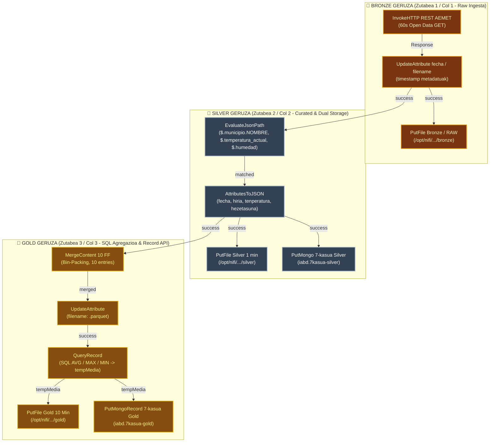

# NiFi 7. Kasua / DF2.3 Ariketa: AEMET Datu-Lakua Osoa (Medallion: Bronze → Silver → Gold)

> **Modulua / Gai-arloa:** Big Data Aplikatua · 01 DataFlow · Apache NiFi Aurreratua  
> **Ariketa Ofiziala:** **DF2.3**  
> **Fitxategi Nagusia:** [`flow_07_aemet_datalake_medallion.json`](file:///home/tears/bigdata/soluzioak/03_DataFlow_Apache_NiFi/07_AEMET_Datu_Lakua_Medallion_DF2.3/flow_07_aemet_datalake_medallion.json)  
> **Iturria:** `01_02_ApacheNifi_aurreratua.pdf` (41–53 eta 62 orr.)

---

## 1. Helburua eta Medallion Arkitektura (Objetivo)

Datu-laku moderno baten arkitektura osoa (**Medallion Architecture: Bronze $\rightarrow$ Silver $\rightarrow$ Gold**) ezartzea estazio meteorologikoetako telemetria-neurketetarako (AEMET):

1. **🥉 BRONZE GERUZA (Gordina / Raw Ingestion):**
   - 30 segundoro neurketak jaso / simulatu (`GenerateFlowFile`).
   - Fitxategi-izen bakarra eta jasotze-data gehitu (`UpdateAttribute`).
   - Datu gordinak aldatu gabe gorde biltegi iraunkorrean (`PutFile` $\rightarrow$ `/bronze/`).
2. **🥈 SILVER GERUZA (Garbiketa, Iragazketa eta Biltegiratze Bikoitza / Dual Storage):**
   - JSON formatutik eremu nagusiak erauzi (`EvaluateJsonPath`: tenperatura, hezetasuna, presioa).
   - Silver JSON estandarra sortu (`AttributesToJSON`).
   - **Biltegiratze bikoitza paraleloan:**
     - Fitxategi-sisteman gorde (`PutFile` $\rightarrow$ `/silver/`).
     - Dokumentu-biltegian gorde (`PutMongo` $\rightarrow$ `7kasua-silver` bilduma).
3. **🥇 GOLD GERUZA (Agregazio Analitikoa eta Record API Karga):**
   - Silver neurketak lotean batu (`MergeContent`: 10 mezu edo 3 minutu).
   - Metadatuak eta Parquet fitxategi-izena ezarri (`UpdateAttribute`).
   - SQL bidezko agregazio estatistikoa (`QueryRecord`: bataz besteko tenperatura, max hezetasuna, min presioa).
   - **Biltegiratze bikoitza:**
     - Analitika fitxategia gorde (`PutFile` $\rightarrow$ `/gold/`).
     - Bulk txertaketa MongoDB-n (`PutMongoRecord` $\rightarrow$ `7kasua-gold` bilduma).

---

## 2. Arkitektura Orokorraren Diagrama (Mermaid - 3 Zutabe / 3 Column Layout)



---

## 3. Geruzen Xehetasun Teknikoak

### 1. 🥉 Bronze Geruza (Ezkerreko Zutabea / Col 1):
- **`InvokeHTTP REST AEMET`:** Open Data AEMET REST API-ari GET kontsulta 60 segundoro (`https://api.el-tiempo.net/json/v3/provincias/03/municipios/03065`).
  - Harremana: `Response` hurrengo prozesadorera.
  - Auto-terminated: `Failure, No Retry, Original, Retry`.
- **`UpdateAttribute fecha / filename`:** 
  - `fecha` = `${now():format('yyyy-MM-dd_HH-mm-ss')}`
  - `filename` = `${now():format('yyyy-MM-dd_HH-mm-ss')}.json`
- **`PutFile Bronze / RAW`:** JSON gordina diskoan gorde aldatu gabe (`/opt/nifi/ariketak/07-ariketa-aemet-datalake/bronze`).

### 2. 🥈 Silver Geruza (Erdiko Zutabea / Col 2):
- **`EvaluateJsonPath`:**
  - `hiria` = `$.municipio.NOMBRE`
  - `tenperatura` = `$.temperatura_actual`
  - `hezetasuna` = `$.humedad`
- **`AttributesToJSON`:** Atributuak JSON garbian bildu (`fecha,hiria,tenperatura,hezetasuna`) eta bi adar paraleloetara igorri (`Destination`: `flowfile-content`).
- **Biltegiratze bikoitza paraleloan:**
  - `PutFile Silver 1 min`: `/opt/nifi/ariketak/07-ariketa-aemet-datalake/silver`
  - `PutMongo 7-kasua Silver`: `iabd.7kasua-silver` bilduman JSON gisa txertatu.

### 3. 🥇 Gold Geruza (Eskuineko Zutabea / Col 3):
- **`MergeContent 10 FF`:**
  - `Merge Strategy`: `Bin-Packing Algorithm`
  - `Minimum Number of Entries`: `10`
  - `Demarcator`: `\n` (lerrojauzia FlowFile-en artean)
- **`UpdateAttribute`:** `filename` = `${filename:substringBeforeLast('.')}.parquet`
- **`QueryRecord`:**
  - Propietate dinamikoa (`tempMedia`):
    ```sql
    select hiria, 
           max(fecha) as fecha, 
           avg(cast(tenperatura as double)) as tenperatura, 
           avg(cast(hezetasuna as double)) as hezetasuna 
    from FLOWFILE 
    group by hiria
    ```
  - Sortutako harremana: `tempMedia` bi helmuga paraleloetara bideratuta.
- **Biltegiratze bikoitza:**
  - `PutFile Gold 10 Min`: `/opt/nifi/ariketak/07-ariketa-aemet-datalake/gold`
  - `PutMongoRecord 7-kasua Gold`: MongoDB-ko `7kasua-gold` bilduman txertatu `MongoDBControllerService` bidez.


---

## 4. Egiaztapen Probak (Datuak eta Datu-baseak)

### Fitxategi-sistemako direktorioak (ebidentzia 2026-09-22, `simulatu_aemet_medallion.py`):
```bash
ls -la /home/tears/bigdata/06_NiFi/soluzioak/07_AEMET_Datu_Lakua_Medallion_DF2.3/bronze/  # 10 JSON gordin
ls -la /home/tears/bigdata/06_NiFi/soluzioak/07_AEMET_Datu_Lakua_Medallion_DF2.3/silver/  # 10 JSON + silver_mongo.jsonl
ls -la /home/tears/bigdata/06_NiFi/soluzioak/07_AEMET_Datu_Lakua_Medallion_DF2.3/gold/    # tempMedia.parquet + .json + gold_mongo.jsonl
/home/tears/bigdata/01_Erronka1_CNC_Guard/proyecto_cnc_guard/.venv/bin/python simulatu_aemet_medallion.py
```

### MongoDB bildumak:
```bash
# Silver bilduma (dokumentu garbiak)
docker exec -it iabd-mongodb-nifi mongosh iabd --eval 'db["7kasua-silver"].find().limit(3).pretty()'

# Gold bilduma (agregazio analitikoak)
docker exec -it iabd-mongodb-nifi mongosh iabd --eval 'db["7kasua-gold"].find().pretty()'
```
