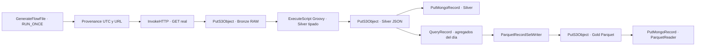

# DF2.3 — Variante Open-Meteo: Medallion ejecutado en NiFi

**Alternativa de laboratorio, no entrega equivalente al enunciado oficial AEMET.**
El [flow AEMET original](flow_07_aemet_datalake_medallion.json) se conserva:
sigue necesitando API key y adaptar Silver a su payload real. Esta variante
cambia explícitamente el proveedor y usa S3 compatible local; no valida AEMET
ni AWS real. No utiliza credenciales de ningún servicio personal.

## Objetivo y entradas

[Flow alternativo importable](flow_07_open_meteo_medallion.json): NiFi 2.0.0 hace
una petición HTTPS real a Open-Meteo para las coordenadas solicitadas de Elche
(38.26218, -0.70107). El endpoint es:

```text
https://api.open-meteo.com/v1/forecast?latitude=38.26218&longitude=-0.70107&hourly=temperature_2m,relative_humidity_2m&forecast_days=1&timezone=UTC
```

[Open-Meteo documenta](https://open-meteo.com/en/docs) las series horarias y la
selección de zona horaria. Son datos calculados por modelos meteorológicos,
**no observaciones de estaciones**. Se solicita un día completo con 24 marcas
horarias UTC diferentes. No representan 24 observaciones estadísticamente
independientes. Repetir el endpoint `current` cada pocos segundos puede devolver
el mismo timestamp; esta variante no usa esas repeticiones como nuevos datos.
Las coordenadas de la celda del modelo pueden diferir de las solicitadas:
ambas se conservan en la evidencia de validación y la respuesta Bronze.

## Recorrido implementado



Bronze guarda el JSON de respuesta completo antes de transformar Silver.
Cada petición usa un UUID para el objeto RAW; Silver y Gold conservan
`source_object` para remontarse a ese Bronze. Los sinks S3 se encadenan por
`success`: un error de escritura no avanza a la siguiente capa. Las ramas
`failure` y los estados HTTP Retry/No Retry preservan su FlowFile en
`/opt/nifi/ariketak/pg7/failures`, dentro del laboratorio, para investigación.
No se implementa un reintento automático ni una política de descarte permanente.

[La transformación Groovy](open_meteo_silver.groovy), ejecutada dentro de NiFi,
comprueba offset UTC, unidades °C/%, longitudes de arrays, horas únicas,
valores numéricos finitos y humedad 0–100. Rechaza nulos o payloads incompatibles;
no inventa valores. Silver es un array JSON con `temperatura_c` y `humedad_pct`
numéricas, timestamp UTC, municipio, proveedor, tipo de dato y procedencia.
`JsonTreeReader` aplica un esquema explícito con **double**, evitando convertir
números en texto. El campo `fetched_at_utc` conserva el instante UTC de **inicio
de la solicitud**, no el instante de observación ni la hora exacta de commit S3.

Gold usa `QueryRecord` sobre las 24 horas del mismo payload. Agrupa por municipio
y procedencia; calcula número de horas, horas distintas, inicio/fin UTC,
temperatura media/mínima/máxima y humedad media. La agregación de un día en
una solicitud sustituye al lote de diez FlowFiles de la propuesta AEMET: no
se presenta como el mismo protocolo. `ParquetRecordSetWriter` genera Parquet
real con Snappy; `ParquetReader` lee esos mismos bytes antes de escribir Mongo.
No se renombra JSON con extensión `.parquet`.

## Preparación del laboratorio

Se ejecutó en el único stack temporal compartido de esta revisión:

| Componente | Configuración comprobada |
|---|---|
| NiFi | `iabd-nifi:2.0.0-local`, contenedor `bigdata-nifi-lab-20261002-nifi`, HTTPS `https://localhost:18443` enlazado solo a `127.0.0.1` |
| MongoDB | `mongo:7.0`, alias interno `mongo:27017`, sin puerto publicado |
| MinIO | Contenedor `bigdata-nifi-lab-20261002-minio`, alias interno `minio:9000`; API local `http://127.0.0.1:19000`; consola sin publicar |
| Red | `bigdata-nifi-lab-20261002-net`, aislada de las redes personales |
| S3 local | Bucket privado `iabd-nifi-open-meteo-lab`; prefijos `bronze/`, `silver/`, `gold/` |
| Mongo | Base `iabd_open_meteo_lab`, colecciones `silver` y `gold` |
| PG | `PG7 Open-Meteo LAB`, exclusivo; los casos 1–6 usan otros grupos |

La imagen de NiFi no incluía Parquet. Se añadieron mediante su directorio
`nar_extensions` los NAR oficiales `nifi-hadoop-libraries-nar:2.0.0` y
`nifi-parquet-nar:2.0.0`, descargados de
[Maven Central](https://repo.maven.apache.org/maven2/org/apache/nifi/) y
contrastados con sus SHA-512 publicados. La carga automática registró
`ParquetReader` y `ParquetRecordSetWriter` sin reiniciar NiFi. Para reproducir,
instala estas extensiones **en tu NiFi de laboratorio**, nunca en un canvas
personal sin autorización.

Las imágenes públicas de MinIO no pudieron descargarse (quay 401 y Docker Hub
denegó acceso); su antiguo archivo de descargas respondió 410. Se usó el
[binario de la release oficial](https://github.com/minio/minio/releases/tag/RELEASE.2025-09-07T16-13-09Z)
`RELEASE.2025-09-07T16-13-09Z` y se contrastó su SHA-256 con el digest de la API
de GitHub:

```text
7c5bd8512c6e966455b1d198209358b2d191c77a83ab377c4073281065fb855f
```

Una imagen local `FROM scratch` contiene solo ese binario y se ejecuta con
UID/GID 1000. Su Dockerfile, compose y datos temporales se prepararon en
`/tmp/bigdata-nifi-lab-20261002/`; no se añaden binarios ni claves al repositorio.
El archivo privado `minio.env` (modo 600) contiene credenciales aleatorias de
este laboratorio. No son claves AWS reales. El certificado de NiFi se exportó
a `nifi-cert.pem` y el cliente verificó CA y hostname localhost; no se desactivó
TLS. El stack se detiene al terminar la validación compartida; las evidencias
versionables permiten revisar los resultados cuando ya no esté activo.

## Receta conservada para el sidecar MinIO

Las plantillas [Dockerfile.minio](lab_open_meteo/Dockerfile.minio) y
[compose.minio.yml](lab_open_meteo/compose.minio.yml) contienen únicamente
configuración de laboratorio. El [preparador](lab_open_meteo/prepare_minio_lab.py)
descarga el binario de la release oficial fijada, verifica el SHA-256 anterior
y copia las plantillas al directorio temporal. Genera claves aleatorias con
modo 600 o reutiliza un archivo privado existente; nunca muestra sus valores.
Rechaza crear runtime dentro del repositorio. **Prepara archivos; no inicia
contenedores ni ejecuta scripts remotos.**

La [receta compartida NiFi/Mongo/MySQL](../scripts/nifi_lab_stack.py) conserva
el nombre de red esperado. En un laboratorio nuevo, con la imagen local NiFi
preparada según el [Dockerfile del caso 6](../06_MariaDB_MongoDB_Laborategia_DF2.2/Dockerfile.nifi),
`python ../scripts/nifi_lab_stack.py up` crea ese stack y sus claves temporales.
No ejecutes `up` si el laboratorio compartido ya existe: la herramienta rehúsa
sobrescribir sus credenciales. Añade después los NAR Parquet descritos arriba.

Después de arrancar ese único stack y su red, desde esta carpeta:

```bash
python lab_open_meteo/prepare_minio_lab.py --runtime-dir /tmp/bigdata-nifi-lab-20261002
docker compose -f /tmp/bigdata-nifi-lab-20261002/compose-minio-generated.yml up --build -d
```

La red externa debe existir; su nombre por defecto es
`bigdata-nifi-lab-20261002-net`. Si tu receta compartida usa otro nombre, pasa
`NIFI_LAB_NETWORK=nombre-de-la-red` al comando compose. La plantilla no crea
otro NiFi ni publica Mongo/consola MinIO. Para crear el bucket, usa un cliente
S3 local con el archivo privado como fuente de credenciales y endpoint
`http://127.0.0.1:19000`; después asigna las mismas claves exclusivamente al
contexto sensible de este flow. No imprimas el archivo ni lo copies a Git.
El bind mount `minio-data` y el UID/GID 1000 corresponden a esta máquina; en
otra máquina hay que adaptar el propietario del directorio o el usuario del
contenedor antes de iniciar el sidecar.

Al terminar y preservar objetos/evidencias:

```bash
docker compose -f /tmp/bigdata-nifi-lab-20261002/compose-minio-generated.yml down
```

Esto retira el contenedor del sidecar y deja los datos temporales. Apaga el
stack compartido NiFi/Mongo únicamente cuando hayan terminado todos sus casos.
La receta queda guardada para reconstruir el sidecar tras desaparecer `/tmp`;
los comandos de esta sección no se volvieron a ejecutar después de completar
la validación live descrita abajo.

## Importar y ejecutar de nuevo

1. Prepara un NiFi 2.0.0 de laboratorio con las extensiones anteriores, MinIO
   y Mongo en su red privada. Crea el bucket `iabd-nifi-open-meteo-lab` en MinIO.
   Usa credenciales aleatorias de laboratorio fuera de Git, con modo 600.
2. Importa el [flow alternativo](flow_07_open_meteo_medallion.json) como un grupo
   nuevo. Los once processors y cinco controller services están exportados
   **DISABLED**, para no iniciar peticiones o escrituras al importar.
3. Rellena los parámetros **sensibles** `LAB_S3_ACCESS_KEY` y
   `LAB_S3_SECRET_KEY` del contexto `PG7 Open-Meteo LAB credentials` con las
   claves del MinIO local. La exportación no contiene valores. No uses roles
   ni credential chains de AWS real.
4. Revisa los cinco servicios privados del grupo: credentials provider con
   `Use Default Credentials=false`, Mongo URI `mongodb://mongo:27017`,
   `JsonTreeReader` con el esquema Silver, writer Parquet Snappy y reader Parquet.
   Los tres `PutS3Object` usan endpoint `http://minio:9000`, región técnica
   `us-east-1` y `Use Path Style Access=true`; esa región no implica usar AWS.
   Adapta los alias si tu red los llama de otro modo.
5. Habilita los servicios, luego los processors. Espera a que todos sean VALID.
   Inicia los diez processors posteriores a la fuente. Usa **Run Once** en
   `One HTTP request per manual run`; no arranques todo el grupo de forma
   periódica. Comprueba Bronze, Silver, Gold y ambas colecciones. El script
   Groovy está embebido en el flow: no necesita una ruta externa de scripts.
6. Espera a que las colas queden vacías; detén el grupo. Si hay failures,
   conserva sus payloads y corrige el error antes de repetir. Compara el JSON
   Bronze con Silver y recalcula las agregaciones de Gold leyendo Parquet.

La ejecución nueva añade UUIDs y documentos. El ejemplo no deduplica entre
solicitudes ni implementa exactly-once: no se debe sumar varios snapshots de
pronóstico como nuevas observaciones. Para probar reintentos/idempotencia,
usa una base y un bucket nuevos de laboratorio y define claves de dominio.

## Resultado observado · 2026-10-02

NiFi hizo una petición de datos real, iniciada a las **07:02:59 UTC**. Se
verificaron objetos de MinIO y documentos de Mongo, no archivos simulados.
Las marcas horarias del modelo van de `2026-10-02T00:00:00Z` a
`2026-10-02T23:00:00Z`.

| Resultado | Valor observado |
|---|---:|
| Objetos Bronze / Silver / Gold | 1 / 1 / 1 |
| Filas Silver / marcas horarias diferentes | 24 / 24 |
| Filas Gold Parquet | 1 |
| Documentos Mongo Silver / Gold | 24 / 1 |
| Temperatura media / mínima / máxima (°C) | 22.383333 / 20.6 / 23.7 |
| Humedad media (%) | 82.208333 |
| FlowFiles pendientes / archivos failure al cierre PG7 | 0 / 0 |

[Validación runtime y manifiesto](evidencias_open_meteo_2026-10-02/validacion.json)
registra IDs y estado de processors, objetos S3, SHA-256, tipos Parquet y
reconciliación. Las copias de [Bronze](evidencias_open_meteo_2026-10-02/bronze.json),
[Silver](evidencias_open_meteo_2026-10-02/silver.json),
[Gold Parquet](evidencias_open_meteo_2026-10-02/gold.parquet) y las exportaciones
Mongo permiten inspeccionar el resultado sin el stack. Mongo se exportó con
EJSON relaxed y sin `_id`, conservando valores/tipos numéricos para compararlos
con Parquet; sus contadores BIGINT se normalizan a enteros JSON.

El [verificador](verify_open_meteo_evidence.py) comprueba hashes, continuidad
horaria UTC, tipos, correspondencia Bronze→Silver, agregados Parquet y ambas
copias Mongo. **Revalida evidencia guardada; no arranca NiFi ni certifica una
nueva ejecución live.** Desde esta carpeta:

```bash
uv venv /tmp/open-meteo-evidence-venv --python 3.13
uv pip install --python /tmp/open-meteo-evidence-venv/bin/python 'pyarrow==25.0.1'
/tmp/open-meteo-evidence-venv/bin/python verify_open_meteo_evidence.py
```

No se ha validado AEMET, AWS, tolerancia a fallos, durabilidad tras destrucción
del laboratorio, recuperación, exactly-once ni un despliegue de producción.
El [simulador histórico](simulatu_aemet_medallion.py) y sus datos anteriores
siguen separados de estas evidencias obtenidas con NiFi.
